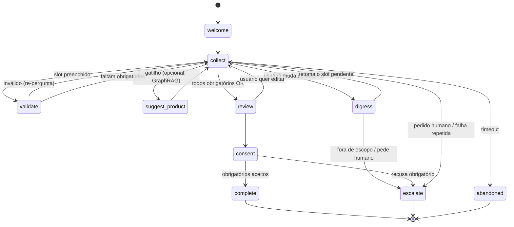

# Agentes Conversacionais (FSM / LangGraph) — Design

> Documento de **design interno** do Marketero. Define o **Agente** como uma IA conversacional que **conduz um Form** — fazendo, em diálogo, as perguntas que hoje um formulário estático faria — e como isso se amarra aos **Forms** da plataforma e às **Campanhas**.
>
> Companheiro de [`visao-geral.md`](./visao-geral.md) (pilares do produto) e de [`integracao-meta-lead-ads-crm.md`](./integracao-meta-lead-ads-crm.md) (o mini-CRM e o vínculo com a Meta). **Não repetimos** o modelo de dados de Lead/Contact/Consent (mini-CRM §6) nem o fluxo de webhooks da Meta — referenciamos e **estendemos**.

---

## Índice

1. [O modelo: Form = programa, Agente = motor](#1-o-modelo-form--programa-agente--motor)
2. [Por que FSM (e onde o LLM entra)](#2-por-que-fsm-e-onde-o-llm-entra)
3. [A máquina de estados do Agente](#3-a-máquina-de-estados-do-agente)
4. [Compilação Form → FSM](#4-compilação-form--fsm)
5. [LangGraph como implementação (e alternativas)](#5-langgraph-como-implementação-e-alternativas)
6. [Persistência: sobreviver ao canal assíncrono](#6-persistência-sobreviver-ao-canal-assíncrono)
7. [Integração com o mini-CRM](#7-integração-com-o-mini-crm)
8. [Campanhas e override de Form](#8-campanhas-e-override-de-form)
9. [Modelo de dados (estendendo o mini-CRM)](#9-modelo-de-dados-estendendo-o-mini-crm)
10. [Decisões em aberto](#10-decisões-em-aberto)

---

## 1. O modelo: Form = programa, Agente = motor

A abstração central — e o que destrava a feature toda:

- **Form** = **um único conceito** na plataforma (o form **do próprio Marketero**), que **pode se conectar/sincronizar com os Instant Forms da Meta**. Em essência, o Form é o **conjunto de perguntas** a capturar (`questions[] = {key, label, type, options, conditional}`) + consentimento (`custom_disclaimer`). É o **"programa"**.
- **Agente** = a **IA conversacional** que **executa** esse programa: faz as perguntas do Form **em diálogo** (DM, WhatsApp, comentário, web chat), entende as respostas em linguagem natural e preenche os campos. É o **"motor"**. Configurável: **modelo** (Opus/Sonnet, etc.), persona/prompt, políticas.
- **Campanha** = vincula `(Agente, Form, canal, audiência)`. O **mesmo Agente** pode rodar um **Form diferente** por campanha → troca o "roteiro de perguntas" sem trocar de agente.

```
   Form (questions)            Agente (modelo + persona)            Campanha
   "o programa"        ─────►  "o motor que executa"      ◄─────   bind (agente, form, canal)
        │                              │                                  │
        │ compila em                   │ conduz a conversa                │ pode trocar o Form
        ▼                              ▼                                  ▼
   máquina de estados  ◄──────  preenche field_data  ──────►  lead no mini-CRM (§7)
```

> **Insight de design:** o Agente **não tem perguntas próprias**. Ele é genérico; o Form é que carrega o conteúdo. Isso é o que permite "criar 1 agente, usar em N campanhas com N forms" sem duplicação — exatamente o cenário que motivou a feature.

---

## 2. Por que FSM (e onde o LLM entra)

Coletar um formulário em conversa **parece** trabalho de LLM puro, mas LLM solto **não dá garantias**: pode pular um campo obrigatório, esquecer de pedir consentimento, ou "alucinar" que já tem um dado. Para captura de lead (com LGPD e CRM no fim), precisamos de **garantias duras**. Daí o híbrido:

| Camada | Dono | Responsabilidade |
|---|---|---|
| **Controle de fluxo** | **FSM (determinístico)** | Quais slots são obrigatórios, ordem válida, **gate de consentimento antes de concluir**, estados terminais, escalonamento. Auditável. |
| **Compreensão (NLU)** | **LLM** | Extrair o valor do slot de texto livre, lidar com **uma resposta que preenche vários campos**, normalizar/validar, re-perguntar com educação, responder dúvidas no meio (via GraphRAG), detectar intenção de desistir/falar com humano. |

A regra: **o LLM entende, a FSM decide.** A FSM nunca deixa avançar para `complete` sem os obrigatórios e o consentimento; o LLM nunca precisa "lembrar" o que falta — a FSM diz.

Isso também conecta com o pilar de automação já documentado (`visao-geral.md` §1, `evento → classificação → ação`): o Agente é a versão **stateful e multi-turno** daquele padrão.

---

## 3. A máquina de estados do Agente

Esqueleto genérico (vale para qualquer Form). Os estados de coleta são **derivados do Form** (§4); os demais são fixos do motor.



- **`welcome`** — abertura (equivale ao `context_card` do Instant Form).
- **`collect`** — **núcleo de slot-filling**. A cada turno: o LLM extrai valores da mensagem → atualiza `slots` → a FSM recomputa **o próximo slot obrigatório ainda vazio** e o pergunta. Como uma mensagem pode preencher **vários** slots, isso **não é linear** — é um controlador que "salta" para o próximo vazio (ver [Decisões em aberto](#10-decisões-em-aberto)).
- **`validate`** — validação **por `type`**: `EMAIL` (regex), `PHONE` (→ E.164, `+55`), `ID_CPF` (dígito verificador), `DATE_TIME` etc. Falhou → volta a perguntar com correção.
- **`review`** — só para forms de **alta intenção** (`is_optimized_for_quality=true`, mini-CRM §2.1): mostra o resumo e pede confirmação/edição.
- **`consent`** — apresenta os `custom_disclaimer.checkboxes`; os **obrigatórios** (`is_required=true`) são **gate duro** — sem aceite, não há `complete` (LGPD, mini-CRM §7).
- **`suggest_product`** *(opcional)* — no meio do fluxo, chama o **GraphRAG** para sugerir um produto (a ação "sugerir produto" do `visao-geral.md` §1, agora dentro da conversa).
- **`complete`** — emite o **lead** (`field_data`), exibe o `thank_you_page`, dispara CRM + Conversion Leads/CAPI (§7).
- **`escalate`** — handoff para humano (no LangGraph, um `interrupt` — §5).
- **`abandoned`** — timeout/sem resposta → grava **lead parcial**, opcional re-engajamento.

### 3.1. Digressão e retomada ("anchor & return")

Comportamento-chave do produto: **o usuário pode mudar de assunto do nada** — fazer uma pergunta, levantar uma objeção, contar um caso — e **o ideal é que o agente volte** ao ponto onde parou. A FSM torna isso natural porque o **slot pendente fica ancorado no estado** (`pending_question`); a digressão é um **self-loop** que não destrói o progresso.

O turno fora de tópico segue 3 passos:

1. **Distinguir.** A mensagem responde ao slot pendente? Responde **outro** slot (preenche e segue — slot-filling)? Ou é **digressão** (pergunta/objeção/tangente, sem valor de slot)?
2. **Atender** a digressão num sub-estado transitório (`digress`): responder via GraphRAG, acolher a objeção — **sem avançar slots**.
3. **Retomar**: re-perguntar o slot pendente com uma ponte natural — *"Voltando — me confirma seu e-mail?"*.

Invariantes:

- `slots` e `pending_question` são **preservados** em toda digressão — retomar é sempre possível.
- **Guard-rail anti-loop:** contar digressões consecutivas **sem progresso**; ao passar de `max_digressions`, ou diante de intenção clara de não responder → `escalate` ou `abandoned`. Sem isso, um usuário enrolão prende o agente para sempre.
- Pedido **explícito** de humano, ou tópico **fora de escopo**, vai direto a `escalate` (não retoma).

---

## 4. Compilação Form → FSM

O Form **compila** numa FSM. Esse é o coração da feature — trocar de Form = recompilar a máquina.

| Elemento do Form | Vira na FSM |
|---|---|
| `questions[].key` | **slot** (campo a preencher) |
| `questions[].type` | **validador/normalizador** do slot (`EMAIL`, `PHONE`, `ID_CPF`, `SLIDER`, `DATE_TIME`…) |
| `questions[].label` + `inline_context` | **prompt** que o LLM usa para perguntar aquele slot |
| **conditional answers** (mini-CRM §2.4) | **transição guardada**: as `options` válidas do slot dependem de `slots` já preenchidos. *(As perguntas são as mesmas; muda o conjunto de respostas — modele como guarda, não como branch de pergunta.)* |
| `custom_disclaimer.checkboxes` | estado **`consent`** (obrigatórios = gate) |
| `context_card` / `thank_you_page` | conteúdo de `welcome` / `complete` |
| `is_optimized_for_quality` | habilita o estado **`review`** |

> Como **forms publicados com leads são imutáveis** (mini-CRM §2.7), a FSM deve ser compilada a partir do **snapshot** do form (`lead_form.snapshot_at`) usado naquela conversa — senão uma edição de form muda o roteiro de conversas em andamento.

---

## 5. LangGraph como implementação (e alternativas)

LangGraph modela exatamente esse híbrido: um **`StateGraph`** com estado tipado, nós (funções) e **arestas condicionais**.

- **Estado** = a conversa: `{ slots, current_state, history, form_snapshot, pending_question }`.
- **Nós** = `welcome`, `collect`, `validate`, `consent`, `complete`, `escalate`… cada um uma função.
- **Arestas condicionais** = a lógica de transição (“próximo slot vazio?”, “validou?”, “consentiu?”).
- **Checkpointer** = persistência durável por `thread_id` (= id da conversa) — essencial para o canal assíncrono (§6).
- **Interrupt / human-in-the-loop** = pausa o grafo em `escalate`, entrega ao humano, e **retoma** depois.

**Alternativas a pesar** (a decisão não está fechada — você disse "talvez"):

| Opção | A favor | Contra |
|---|---|---|
| **LangGraph** | Checkpointing, interrupts e branching prontos; ecossistema | Dependência pesada; opinativo; Python-cêntrico |
| **FSM própria** (ex.: tabela de transição + worker) | Leve, controle total, casa com o pipeline `webhook → fila → worker` já existente | Reimplementar checkpoint/retoma |
| **XState** (TS) | FSM/statechart de 1ª classe, ótimo se o backend for Node | NLU/LLM e persistência ficam por sua conta |

> Recomendação inicial: **prototipar a tabela de transição como dado** (Form → FSM) independente do runtime, para não acoplar o produto a um framework antes de validar. O runtime (LangGraph vs próprio) vira detalhe de implementação.

> Ver [`workflows-visuais.md`](./workflows-visuais.md) — a investigação de **motores de execução / editores visuais** (React Flow, BPMN) é a base técnica candidata para rodar e **editar visualmente** essa FSM. A FSM do Agente pode ser um caso particular do mesmo motor de automação de fluxos descrito em `visao-geral.md` §1.

---

## 6. Persistência: sobreviver ao canal assíncrono

Conversas acontecem em canais **event-driven** (DM/WhatsApp via webhook — o mesmo pipeline `ack-fast + fila` do mini-CRM §6.1). Entre duas mensagens do usuário, **não há processo vivo**. Logo:

1. Cada mensagem que chega resolve a **conversa** por `(tenant, contact, canal)` → `thread_id`.
2. Carrega o **checkpoint** (estado da FSM + `slots`).
3. Roda a FSM a partir do `current_state`, processa a mensagem, **persiste** o novo estado, responde.

A conversa é a **instância da FSM**; o checkpoint é o que torna multi-turno confiável apesar do `ack < 2s`. É o mesmo princípio de idempotência/retoma já adotado para leads da Meta.

---

## 7. Integração com o mini-CRM

No `complete`, o Agente emite um lead em formato **idêntico** ao de um Instant Form: `field_data = [{name, values[]}]`, mapeado por `key` (mini-CRM §6.3). Assim **lead conversacional** e **lead de form Meta** caem no **mesmo `lead`/`contact`**, com a **mesma dedup** (email/phone normalizado+hash) e o **mesmo consent record** (`custom_disclaimer_responses` ↔ `lead_consent`).

⚠️ **Refator necessário no mini-CRM:** hoje `lead` tem `leadgen_id` como PK (mini-CRM §6.2) — específico da Meta. Leads conversacionais **não têm** `leadgen_id`. Generalizar:

- PK própria (`lead_id UUID`) + coluna **`source`** (`meta_leadgen | conversational | web_form`).
- `leadgen_id` vira **opcional** (preenchido só quando `source = meta_leadgen`), mantendo a idempotência `ON CONFLICT` para a Meta.
- Conversão de volta (CAPI/Conversion Leads, mini-CRM §6.6) **só** para leads com `leadgen_id` — leads conversacionais puros não entram nessa otimização (não têm Facebook Lead ID).

---

## 8. Campanhas e override de Form

```
Agente.default_form_id        ← o Form padrão do agente
Campanha.agent_id             ← qual agente conduz
Campanha.form_id  (nullable)  ← override; se NULL, usa Agente.default_form_id
```

Em runtime, ao iniciar uma conversa **no contexto de uma campanha**, a FSM é compilada de `Campanha.form_id ?? Agente.default_form_id`. Fora de campanha (ex.: DM espontânea), usa o default do agente. É o padrão **default + override por escopo** — um agente, vários roteiros.

---

## 9. Modelo de dados (estendendo o mini-CRM)

```sql
-- Form próprio da plataforma (pode espelhar um Instant Form da Meta)
CREATE TABLE form (
  id                UUID PRIMARY KEY,
  tenant_id         UUID NOT NULL REFERENCES crm_tenant(id),
  name              TEXT NOT NULL,
  questions         JSONB NOT NULL,          -- [{key,label,type,options,conditional}]
  custom_disclaimer JSONB,                   -- consentimento (gate de consent)
  meta_form_id      TEXT,                    -- vínculo opcional com Instant Form (NULL = só plataforma)
  status            TEXT DEFAULT 'draft',    -- draft|active|archived
  created_at        TIMESTAMPTZ DEFAULT now()
);

-- Agente: o motor configurável
CREATE TABLE agent (
  id                UUID PRIMARY KEY,
  tenant_id         UUID NOT NULL REFERENCES crm_tenant(id),
  name              TEXT NOT NULL,
  model             TEXT NOT NULL,           -- 'claude-opus-4-8' | 'claude-sonnet-4-6' | ...
  system_prompt     TEXT,                    -- persona/instruções
  default_form_id   UUID REFERENCES form(id),
  escalation_policy JSONB,                   -- quando dar handoff (ver §10)
  created_at        TIMESTAMPTZ DEFAULT now()
);

-- Campanha: bind (agente, form, canal)
CREATE TABLE campaign (
  id                UUID PRIMARY KEY,
  tenant_id         UUID NOT NULL REFERENCES crm_tenant(id),
  agent_id          UUID NOT NULL REFERENCES agent(id),
  form_id           UUID REFERENCES form(id),  -- NULL => usa agent.default_form_id
  channel           TEXT NOT NULL,             -- 'whatsapp'|'instagram_dm'|'web_chat'|...
  status            TEXT DEFAULT 'draft',
  created_at        TIMESTAMPTZ DEFAULT now()
);

-- Conversa: a INSTÂNCIA da FSM (âncora do checkpoint)
CREATE TABLE conversation (
  id                UUID PRIMARY KEY,
  tenant_id         UUID NOT NULL REFERENCES crm_tenant(id),
  agent_id          UUID NOT NULL REFERENCES agent(id),
  form_id           UUID NOT NULL REFERENCES form(id),     -- resolvido (override ou default)
  form_snapshot_at  TIMESTAMPTZ NOT NULL,                  -- versão do form compilada
  campaign_id       UUID REFERENCES campaign(id),          -- NULL se espontânea
  contact_id        UUID REFERENCES contact(id),
  channel           TEXT NOT NULL,
  thread_id         TEXT NOT NULL,                         -- chave de checkpoint (LangGraph/próprio)
  current_state     TEXT NOT NULL DEFAULT 'welcome',
  pending_question  TEXT,                                  -- slot ancorado (anchor & return, §3.1)
  slots             JSONB NOT NULL DEFAULT '{}',           -- campos já preenchidos
  digressions       INT NOT NULL DEFAULT 0,                -- consecutivas sem progresso (guard-rail)
  status            TEXT NOT NULL DEFAULT 'active',        -- active|completed|escalated|abandoned
  started_at        TIMESTAMPTZ DEFAULT now(),
  last_event_at     TIMESTAMPTZ DEFAULT now(),
  UNIQUE (tenant_id, channel, contact_id)                  -- 1 conversa ativa por contato/canal
);
```

No `complete`, a `conversation.slots` vira `field_data` e segue o pipeline de persistência do lead (§7).

---

## 10. Decisões em aberto

1. ~~Política de transição em `collect`~~ — **RESOLVIDO:** **slot-filling com âncora** + **digressão/retomada** (§3.1). O agente preenche o 1º obrigatório vazio, aceita respostas fora de ordem, e sempre **volta** ao slot pendente após uma digressão. Falta só calibrar `max_digressions` (item 3).
2. **Runtime**: LangGraph vs FSM própria vs XState (§5). Depende da stack do backend (Python vs Node) — **a definir**.
3. ~~`escalation_policy`~~ — **RESOLVIDO** (defaults abaixo; calibrar com conversa real). Gatilhos e limiares de `escalate`/`abandoned`.
4. **Abandono**: timeout (minutos/horas?) e se há re-engajamento automático.
5. **GraphRAG em `suggest_product`**: o agente sugere proativamente ou só quando o usuário pergunta?
6. **Sincronização Form ↔ Meta**: criar o Instant Form via API a partir do Form da plataforma, ou só importar? (liga em mini-CRM §2.2)

### Roteamento de turno — decisão tomada

A política está fechada (slot-filling + âncora). O esqueleto resultante; o **TODO restante** é só calibrar os limiares de escalonamento:

```ts
// 1) Cada mensagem recebida é roteada por intenção, NUNCA perdendo o slot pendente.
function routeTurn(msg: UserMessage, conv: Conversation, form: CompiledForm): Action {
  const filled = extractSlots(msg, form);          // LLM: pode preencher vários slots de uma vez
  if (Object.keys(filled).length > 0) {
    conv.slots = { ...conv.slots, ...filled };      // slot-filling: aceita resposta fora de ordem
    conv.digressions = 0;                            // houve progresso → zera contador
    return ask(nextSlot(conv.slots, form));          // pergunta o próximo pendente (ou "review")
  }
  // sem valor de slot → digressão: atende e RETOMA o pendente (anchor & return, §3.1)
  conv.digressions += 1;
  const p = agent.escalation_policy;                  // defaults em §10
  if (msg.wantsHuman || isOutOfScope(msg)) return escalate("explicit_or_out_of_scope");
  if (conv.digressions > p.max_digressions) return escalate("digression_limit");
  return answerThenReask(msg, conv.pending_question); // GraphRAG + ponte de volta
}

// 2) Próximo slot = 1º obrigatório ainda vazio, respeitando conditional answers.
function nextSlot(slots: Record<string, unknown>, form: CompiledForm): SlotKey | "review" {
  return form.requiredSlots.find(s => isVisible(s, slots) && slots[s] == null) ?? "review";
}
```

### Defaults de `escalation_policy`

Valor inicial do `agent.escalation_policy` (§9) — **por agente**, sobrescrevível; calibrar com conversa real:

```jsonc
{
  "max_digressions": 3,          // saídas de roteiro sem progresso → escalate
  "max_validation_retries": 2,   // re-perguntar o mesmo campo N vezes → escalate
  "abandon_after": "24h",        // sem resposta nesse prazo → abandoned (grava lead parcial)
  "reengage_before_abandon": true,// 1 nudge antes de marcar abandoned
  "immediate_escalation": [      // gatilhos que pulam a retomada e vão direto a humano
    "explicit_human_request",    // usuário pede atendente
    "out_of_scope",              // tópico fora do que o agente cobre
    "negative_sentiment"         // frustração/raiva detectada
  ]
}
```

Notas de design:

- **`negative_sentiment`** é o gatilho mais subjetivo — começar conservador (só escalar em sinais fortes) para não derrubar conversas saudáveis em humano à toa.
- Contadores (`digressions`, retries de validação) vivem na `conversation` e **zeram a cada progresso** — o limiar é de *teimosia consecutiva*, não acumulado da conversa toda.
- `abandoned` **não descarta**: grava o lead parcial (slots já preenchidos) — meio lead vale mais que zero.
- Esses números são **de produto, não técnicos** — o doc fixa um ponto de partida; o ajuste fino é empírico.

- [visao-geral.md](./visao-geral.md) — pilares do produto (automação `evento → classificação → ação`, GraphRAG).
- [integracao-meta-lead-ads-crm.md](./integracao-meta-lead-ads-crm.md) — mini-CRM (Lead/Contact/Consent), Instant Forms, webhooks, CAPI.
- [workflows-visuais.md](./workflows-visuais.md) — motores de execução / editor visual de fluxos (React Flow, BPMN); runtime candidato para a FSM.
- [editores-ui-page-form-builders.md](./editores-ui-page-form-builders.md) — form builders; onde o Form (perguntas) é construído antes de virar roteiro do Agente.
