# API do Instagram — Guia de Automação para o Marketero

O **Marketero** é uma plataforma SaaS multi-tenant de automação de marketing no Instagram, construída sobre um motor de IA **GraphRAG** que opera no modelo **evento → classificação → ação**: cada interação capturada via webhook (comentário, DM, menção, referral de anúncio) é normalizada, classificada quanto a intenção/sentimento/rota pela IA e convertida em uma ação concreta na Graph API (responder comentário, enviar DM, sugerir produto, escalar para humano, registrar conversão). Este guia consolida tudo o que a engenharia do Marketero precisa para integrar a Plataforma Instagram da Meta com segurança, escala e conformidade. Todas as referências usam a versão atual da Graph API, **v25.0** (lançada em 18 de fevereiro de 2026).

> [!NOTE]
> **Estado das versões (junho de 2026):** a versão mais recente é a **v25.0**. Versões ativas: v21.0, v22.0, v23.0, v24.0, v25.0. Cada versão tem suporte de ~2 anos após o lançamento da subsequente. Sempre fixe a versão explicitamente na URL (`/v25.0/`) — chamadas sem versão usam a "current default", que muda sem aviso.

---

## Sumário

1. [Decisão de arquitetura: qual variante da API usar](#decisão-de-arquitetura-qual-variante-da-api-usar)
2. [Pré-requisitos e onboarding de contas](#pré-requisitos-e-onboarding-de-contas)
3. [Comentários](#comentários)
4. [Mensagens / DM](#mensagens--dm)
5. [Publicação & Agendamento](#publicação--agendamento)
6. [Webhooks](#webhooks)
7. [Insights / Métricas](#insights--métricas)
8. [Remarketing / Ads](#remarketing--ads)
9. [Limites de taxa, políticas e App Review](#limites-de-taxa-políticas-e-app-review)
10. [Arquitetura de integração no Marketero](#arquitetura-de-integração-no-marketero)
11. [Mapa de casos de uso do Marketero → APIs](#mapa-de-casos-de-uso-do-marketero--apis)
12. [Riscos e armadilhas](#riscos-e-armadilhas)
13. [Próximos passos / roadmap de integração](#próximos-passos--roadmap-de-integração)
14. [Referências](#referências)

---

## Decisão de arquitetura: qual variante da API usar

A Meta oferece **duas variantes** da Plataforma Instagram, com hosts, tokens e capacidades distintas. A escolha é a decisão arquitetural mais importante do projeto.

| Critério | **Instagram API with Instagram Login** | **Instagram API with Facebook Login** |
|---|---|---|
| Host da Graph API | `graph.instagram.com` | `graph.facebook.com` |
| Autenticação | Credenciais do Instagram | Credenciais do Facebook |
| Tipo de token | Instagram User Access Token | Facebook User Token / Page Access Token |
| Página do Facebook obrigatória | **Não** | **Sim** (conta IG vinculada a uma Página) |
| OAuth (authorize) | `https://www.instagram.com/oauth/authorize` | `https://www.facebook.com/dialog/oauth` |
| Comentários / DM / Publicação / Insights | Sim | Sim |
| Busca por hashtags | Não | **Exclusivo** |
| Shopping / Product Tagging | Não | **Exclusivo** |
| Partnership / Branded Content Ads | Não | **Exclusivo** |
| Business Discovery | Não | **Exclusivo** |
| `story_insights` via webhook | Não | **Exclusivo** |
| Collaborators / Upload resumável de vídeo | Não | Sim |
| Marketing API (Ads) | Indireta (System User + Business Manager) | Direta |
| Complexidade de setup | Menor | Maior |

### Recomendação para o Marketero

> [!IMPORTANT]
> **Base = Instagram Login.** Use a variante **Instagram Login** como espinha dorsal para os fluxos centrais do produto — auto-resposta de comentários, DMs, private replies, publicação/agendamento e insights — porque não exige Página do Facebook, simplifica o onboarding dos clientes e representa o futuro da plataforma.
>
> **Camada opcional = Facebook Login.** Habilite **Facebook Login** apenas para clientes que precisem de **hashtag tracking, product tagging, Business Discovery, `story_insights` confiável ou anúncios** (Marketing API / Click-to-Instagram-Direct). Esses recursos exigem que o usuário tenha e vincule uma Página do Facebook.

Implemente um campo `variant` (`instagram_login` | `facebook_login`) por conta conectada e use *feature flags* para desabilitar funcionalidades exclusivas do Facebook Login para contas que entraram via Instagram Login.

---

## Pré-requisitos e onboarding de contas

### Tipos de conta

A Plataforma Instagram **não acessa contas pessoais (consumer)**. Apenas **contas profissionais**:

- **Business Account** — empresas; acesso a todos os recursos, incluindo Shopping e Partnership Ads. Stories via API (na variante Facebook Login) exigem Business.
- **Creator Account** — criadores/influenciadores; acesso à maioria dos recursos.

Conversão: o usuário faz no app (**Configurações → Conta → Mudar para conta profissional**). No fluxo **Facebook Login for Business**, conversão, criação de Página e vínculo são consolidados em uma única janela via `extras={"setup":{"channel":"IG_API_ONBOARDING"}}`.

### Criação do App (Meta App Dashboard)

1. [developers.facebook.com/apps](https://developers.facebook.com/apps) → **Criar App** → tipo **Negócios (Business)** (obrigatório para o produto Instagram).
2. **Adicionar produtos** → **Instagram** (habilita Instagram Login automaticamente; adicione Facebook Login for Business se necessário) → **Webhooks**.
3. Configure no painel: **OAuth Redirect URIs**, **Deauthorize Callback URL**, **Data Deletion Request URL** (obrigatória para App Review), contas de teste.
4. Credenciais: **App ID** (`client_id`, público) e **App Secret** (NUNCA no frontend).

### Fluxo OAuth — Instagram Login

| Etapa | Endpoint | Método |
|---|---|---|
| 1. Autorização | `https://www.instagram.com/oauth/authorize` | GET |
| 2. Code → token curto | `https://api.instagram.com/oauth/access_token` | POST |
| 3. Token curto → token longo (60d) | `https://graph.instagram.com/access_token` | GET |
| 4. Refresh do token longo | `https://graph.instagram.com/refresh_access_token` | GET |

**Etapa 1 — Autorização:**
```
GET https://www.instagram.com/oauth/authorize
  ?client_id={APP_ID}
  &redirect_uri=https://marketero.app/oauth/instagram/callback
  &response_type=code
  &scope=instagram_business_basic,instagram_business_manage_messages,instagram_business_manage_comments,instagram_business_content_publish
  &state={CSRF_TOKEN}
```
> [!WARNING]
> O `code` retornado vem com o sufixo `#_` no final que **deve ser removido**. É de **uso único** e válido por **1 hora**.

**Etapa 2 — Code → token curto (server-side):**
```bash
curl -X POST 'https://api.instagram.com/oauth/access_token' \
  -F 'client_id={APP_ID}' \
  -F 'client_secret={APP_SECRET}' \
  -F 'grant_type=authorization_code' \
  -F 'redirect_uri=https://marketero.app/oauth/instagram/callback' \
  -F 'code=AQBx-hBsH3...Iue8'
```
```json
{ "access_token": "IGQVJ...", "token_type": "bearer", "expires_in": 3600, "user_id": "17841405793187218" }
```
O `user_id` é o **IGSID** (Instagram-scoped User ID), usado como `{IG_USER_ID}` nas chamadas subsequentes.

**Etapa 3 — Token longo (60 dias):**
```bash
curl -X GET 'https://graph.instagram.com/access_token' \
  -d 'grant_type=ig_exchange_token' \
  -d 'client_secret={APP_SECRET}' \
  -d 'access_token=IGQVJ...'
```
```json
{ "access_token": "lZAfb2dhVW...", "token_type": "bearer", "expires_in": 5184000 }
```

**Etapa 4 — Refresh (token ≥ 24h e não expirado):**
```bash
curl -X GET 'https://graph.instagram.com/refresh_access_token' \
  -d 'grant_type=ig_refresh_token' \
  -d 'access_token=lZAfb2dhVW...'
```
Tokens **não se renovam sozinhos**; tokens não usados por 60 dias expiram permanentemente (o usuário precisa re-autorizar). Estratégia do Marketero: job diário que renova proativamente tokens com `expires_at < NOW() + 15 dias`.

### Fluxo OAuth — Facebook Login (resumo)

1. `GET https://www.facebook.com/dialog/oauth?...&scope=instagram_basic,instagram_content_publish,...,pages_show_list,pages_read_engagement` → User Access Token.
2. `GET /v25.0/me/accounts` → Page Access Token (`tasks`).
3. `GET /v25.0/{PAGE_ID}?fields=instagram_business_account` → `{IG_USER_ID}`. Todas as chamadas usam `PAGE_ACCESS_TOKEN` em `graph.facebook.com`.

### Tabela de escopos

| Escopo | Variante | O que libera |
|---|---|---|
| `instagram_business_basic` | IG Login | Perfil/mídia básicos. **Obrigatório** e pré-requisito para refresh de token. |
| `instagram_business_content_publish` | IG Login | Criar containers e publicar (feed, reels, carrossel). |
| `instagram_business_manage_comments` | IG Login | Ler, responder, ocultar, deletar comentários; webhooks de comments/mentions. |
| `instagram_business_manage_messages` | IG Login | Ler/enviar DMs (Send API), private replies. |
| `instagram_business_manage_insights` | IG Login | Métricas de conta e mídia. |
| `instagram_basic` | FB Login | Perfil/mídia básicos (equivalente ao `_business_basic`). |
| `instagram_content_publish` | FB Login | Publicação de posts e stories orgânicos. |
| `instagram_manage_comments` | FB Login | Gestão de comentários. |
| `instagram_manage_messages` | FB Login | DMs via Messenger Platform. |
| `instagram_manage_insights` | FB Login | Métricas; necessário para webhook `story_insights`. |
| `instagram_shopping_tag_products` | FB Login | Product tagging (requer `catalog_management`). |
| `pages_show_list` | FB Login | Listar Páginas do usuário. |
| `pages_read_engagement` | FB Login | Ler engajamento/insights da Página. |
| `pages_manage_metadata` | FB Login | Assinar webhooks da Página. |
| `ads_management` / `ads_read` | Ambas | Marketing API; obrigatório se o papel na Página vier do Business Manager. |
| `business_management` | FB Login | Gerenciar Business Manager / System Users. |
| `leads_retrieval` | FB Login | Ler dados de Lead Ads. |
| **Human Agent** (feature, não scope) | Ambas | Permite agente humano responder DMs em janela de 7 dias. Habilitado no dashboard. |

> [!IMPORTANT]
> **Depreciação já em vigor (passado):** Em **27 de janeiro de 2025**, os escopos sem prefixo `instagram_` (`business_basic`, `business_content_publish`, `business_manage_comments`, `business_manage_messages`) foram depreciados. Apps que não migraram **já perderam acesso** aos endpoints do Instagram. Fonte: [changelog da Instagram Platform](https://developers.facebook.com/docs/instagram-platform/changelog/). Os escopos `instagram_business_*` são exclusivos da variante Instagram Login; os escopos `instagram_*` continuam válidos na variante Facebook Login.

### Níveis de acesso

| Nível | Requisito | Uso |
|---|---|---|
| **Standard Access** | Nenhum (padrão em dev) | Apenas contas que você mesmo gerencia |
| **Advanced Access** | **App Review + Business Verification** | Contas de terceiros (SaaS multi-tenant) |

Para o Marketero, **Advanced Access é obrigatório** em todas as permissões relevantes antes de produção.

---

## Comentários

Permite ler, responder, comentar, ocultar/exibir, habilitar/desabilitar e deletar comentários **de mídias da própria conta**. Para comentários em mídias de terceiros, use a Mentions API (mais limitada).

### Ler comentários — `GET /{media-id}/comments`

```bash
curl -i -X GET \
  "https://graph.instagram.com/v25.0/{IG_MEDIA_ID}/comments?fields=id,text,timestamp,username,like_count,hidden,from,replies&access_token={TOKEN}"
```
- Máximo **50 comentários por consulta**; paginação por cursor (`after`/`before`).
- Ordenação reversa cronológica; replies só vêm com expansão de campo (`replies{id,text,timestamp}`).
- Campos do nó `IG Comment`: `id`, `text`, `timestamp`, `username`, `from`, `like_count`, `hidden`, `parent_id`, `media`, `replies`.

> [!TIP]
> A Meta recomenda **webhooks em vez de polling** para evitar rate limiting. Assine o campo `comments` e processe em tempo real.

### Responder comentário — `POST /{comment-id}/replies`

```bash
curl -i -X POST "https://graph.instagram.com/v25.0/{IG_COMMENT_ID}/replies" \
  -d "message=Obrigado pelo feedback! Te chamamos no DM 😊" \
  -d "access_token={TOKEN}"
```
```json
{ "id": "17873440459141021" }
```
Restrições: só **comentários top-level** (responder uma reply redireciona ao pai); não funciona em **ocultos** nem em **Live**; só em mídias próprias.

### Comentar / Ocultar / Habilitar / Deletar

```bash
# Comentar em mídia própria
curl -X POST "https://graph.instagram.com/v25.0/{IG_MEDIA_ID}/comments" -d "message=Link na bio 👆" -d "access_token={TOKEN}"
# Ocultar / exibir
curl -X POST "https://graph.instagram.com/v25.0/{IG_COMMENT_ID}?hide=true&access_token={TOKEN}"
# Habilitar/desabilitar seção de comentários
curl -X POST "https://graph.instagram.com/v25.0/{IG_MEDIA_ID}?comment_enabled=false&access_token={TOKEN}"
# Deletar
curl -X DELETE "https://graph.instagram.com/v25.0/{IG_COMMENT_ID}?access_token={TOKEN}"
```
`hide` esconde do público mas o autor ainda vê; deletar é irreversível e só pelo dono da mídia ou autor do comentário.

### Private Reply (comment → DM) — `POST /{ig-user-id}/messages`

Envia uma DM ao autor de um comentário. Recurso central para o funil comentário→DM do Marketero.
```bash
curl -i -X POST "https://graph.instagram.com/v25.0/{IG_USER_ID}/messages" \
  -H "Content-Type: application/json" \
  -d '{"recipient":{"comment_id":"17870913679156914"},"message":{"text":"Confira nossa oferta exclusiva no link da bio!"}}' \
  -G -d "access_token={TOKEN}"
```

| Tipo de comentário | Janela para Private Reply |
|---|---|
| Posts e Reels | **7 dias** a partir do comentário |
| Stories | **7 dias** |
| Instagram Live | Apenas durante a transmissão ativa |

> [!WARNING]
> **Apenas 1 mensagem inicial por comentário**, somente texto (sem mídia). Após a janela, a API retorna erro. Se o usuário não segue a conta, a mensagem vai para "Solicitações".

**Limites:** Private Reply em posts/reels = **750 chamadas/hora** por conta; em Live = **100 chamadas/segundo**.

**Permissões:** IG Login → `instagram_business_basic` + `instagram_business_manage_comments` (+ `instagram_business_manage_messages` para private reply). FB Login → `instagram_basic` + `instagram_manage_comments` (+ `instagram_manage_messages`, `pages_read_engagement`).

### @Mentions

Após webhook `mentions` com `comment_id`, busque o conteúdo:
```bash
curl -i -X GET "https://graph.facebook.com/v25.0/{IG_USER_ID}?fields=mentioned_comment.comment_id({COMMENT_ID}){id,text,timestamp,like_count,media}&access_token={TOKEN}"
```
Mídias em que você foi tagueado: `GET /{IG_USER_ID}/tags`. Menções em Stories não são suportadas; a Meta **não armazena** dados de webhook de menções — persista imediatamente.

---

## Mensagens / DM

### Distinção entre variantes

| Característica | Instagram Login | Facebook Login (Messenger Platform) |
|---|---|---|
| Host | `graph.instagram.com` | `graph.facebook.com` |
| Endpoint de envio | `POST /{IG_USER_ID}/messages` | `POST /me/messages` ou `/{PAGE_ID}/messages` |
| Token | Instagram User Access Token | Page Access Token |
| Escopos | `instagram_business_basic` + `instagram_business_manage_messages` | `pages_messaging` + `instagram_manage_messages` |
| Roteamento humano | Conversation Routing | Conversation Routing (substitui o Handover Protocol clássico) |

### Receber mensagens (webhooks)

Campos: `messages` (DMs, story replies, story mentions), `messaging_postbacks`, `message_reactions`, `messaging_seen`, `messaging_referral`, `messaging_optins`, `message_echoes`. (Payloads detalhados na seção [Webhooks](#webhooks).)

> **IGSID:** chega em `sender.id` de qualquer webhook de mensagem. Não é possível buscar o IGSID de um usuário arbitrário — a conversa deve ser iniciada pelo usuário.

### Enviar mensagens — `POST /{IG_USER_ID}/messages`

```bash
curl -X POST "https://graph.instagram.com/v25.0/{IG_USER_ID}/messages" \
  -H "Authorization: Bearer {TOKEN}" -H "Content-Type: application/json" \
  -d '{"recipient":{"id":"{IGSID}"},"message":{"text":"Olá! Como posso ajudar?"}}'
```
```json
{ "recipient_id": "{IGSID}", "message_id": "aWdIOMSB..." }
```

| Tipo | Exemplo de `message` | Limites |
|---|---|---|
| Texto | `{"text":"..."}` | UTF-8, máx. 1000 bytes |
| Imagem | `{"attachment":{"type":"image","payload":{"url":"..."}}}` | PNG/JPEG, 8 MB, até 10 |
| Áudio/Vídeo/Arquivo | `type: audio\|video\|file` | máx. 25 MB; 10 calls/s |
| Compartilhar post | `{"attachment":{"type":"MEDIA_SHARE","payload":{"id":"{MEDIA_ID}"}}}` | post deve ser do app user |
| Sticker coração | `{"attachment":{"type":"like_heart"}}` | — |
| Reação | `sender_action: react` + `payload{message_id, reaction}` | — |
| Sender actions | `{"sender_action":"typing_on\|typing_off\|mark_seen"}` | não misturar com `message` |

### Janela padrão de 24 horas

> [!IMPORTANT]
> **Regra central:** o app só pode enviar mensagens **após** o usuário enviar uma mensagem, e tem **24 horas** para responder. A empresa não pode iniciar o contato.

**Abrem a janela:** DM do usuário, story reply, story mention, clique em CTA que inicia conversa, resposta dentro da conversa. **Não abrem:** curtir, ver perfil, clicar em link externo.

> [!NOTE]
> **Sobre o "reset" da janela:** a documentação oficial **não** descreve reset automático genérico a cada mensagem do usuário. O mecanismo de reset documentado é via **ig.me links** (clicar em um ig.me dentro de uma conversa existente reinicia a janela após o webhook `messaging_referral`) e o contexto de **anúncios** (controle por 24h a partir da última mensagem do usuário). Dentro da janela: envio livre, inclusive conteúdo promocional. Fora dela: somente com tag válida (Human Agent) ou opt-in.

### Message Tags e HUMAN_AGENT (7 dias)

```bash
curl -X POST "https://graph.instagram.com/v25.0/{IG_USER_ID}/messages" \
  -H "Content-Type: application/json" \
  -d '{"recipient":{"id":"{IGSID}"},"message":{"text":"Um agente humano retornará em breve."},"messaging_type":"MESSAGE_TAG","tag":"HUMAN_AGENT"}'
```

> [!CAUTION]
> **HUMAN_AGENT só pode ser usada por agentes humanos reais.** Usar essa tag em respostas automáticas de IA é a violação mais comum e punida (perda de acesso à API). O Marketero deve transferir para um humano (fila/inbox) antes de enviar com essa tag.

`messaging_type`: `RESPONSE` (padrão na janela), `UPDATE` (proativa na janela), `MESSAGE_TAG` (fora da janela com tag).

> [!WARNING]
> **Tags depreciadas (passado, 27/04/2026):** `CONFIRMED_EVENT_UPDATE`, `ACCOUNT_UPDATE`, `POST_PURCHASE_UPDATE` retornam erro 100. Apenas `HUMAN_AGENT` permanece válida fora da janela. Migre para Utility Templates / Marketing Messages.

### Quick Replies, Templates, Ice Breakers

- **Quick Replies:** até **13** botões (`title` ≤ 20 chars); só mobile; `content_type`: `text`, `user_phone_number`, `user_email`.
- **Button Template:** texto ≤ 640 chars, até **3 botões** (`web_url`, `postback`; `call` não suportado no IG).
- **Generic Template (carrossel):** até **10 elementos**, `title` ≤ 80, até 3 botões; só mobile.
- **Media Template:** imagem/vídeo com botões.
- **Ice Breakers** (`POST /{IG_USER_ID}/messenger_profile`): até **4 perguntas**, multilíngue via `locale`. Disparam `messaging_postbacks` ao serem tocados. **Requisito:** referrals de ig.me só funcionam para novas conversas se a conta tiver ≥ 1 Ice Breaker.
- **Persistent Menu:** só na variante Facebook Login.

### ig.me Links — conversation starters e remarketing

```
https://ig.me/m/{username}?ref=campanha_remarketing_produto_a
```
- `ref` ≤ 2.083 chars; chega via webhook `messaging_referral` (`referral.ref`).
- **Reinicia a janela de 24h** — ideal para reengajamento.

### Conversation Routing (ex-Handover Protocol)

A Meta migrou o Instagram para **Conversation Routing** (compatível com as APIs de Handover). Transferir/retomar controle entre o bot e o atendimento humano (Meta Business Inbox: `target_app_id = 263902037430900`):

```bash
curl -X POST "https://graph.facebook.com/v25.0/{PAGE_ID}/pass_thread_control" -H "Content-Type: application/json" \
  -d '{"access_token":"{PAGE_TOKEN}","recipient":{"id":"{IGSID}"},"target_app_id":"263902037430900","metadata":"Escalando para humano"}'
# take_thread_control / request_thread_control análogos
# Verificar propriedade: GET /{CONVERSATION_ID}?fields=is_owner
```

### Conversations API — histórico

```bash
curl "https://graph.instagram.com/v25.0/{IG_USER_ID}/conversations?platform=instagram&user_id={IGSID}&fields=messages"
```
> [!WARNING]
> Retorna apenas as **20 mensagens mais recentes** por conversa; conversas em **Requests** inativas há 30+ dias não são retornadas. Limite: 2 chamadas/segundo por conta.

### Janelas estendidas

- **One-Time Notification (OTN):** uma mensagem futura por opt-in. Novos acessos pausados desde fev/2024 (só contas previamente aprovadas).
- **Marketing Messages (notificações recorrentes):** opt-in dentro da janela de 24h; máx. 1 pedido de opt-in por usuário por semana no mesmo tópico; conteúdo deve corresponder ao tópico aceito.

---

## Publicação & Agendamento

### Fluxo de 2 passos (todos os tipos de mídia)

```bash
# 1. Criar container
curl -X POST "https://graph.instagram.com/v25.0/{IG_USER_ID}/media" -H "Authorization: Bearer {TOKEN}" \
  -H "Content-Type: application/json" \
  -d '{"image_url":"https://cdn.marketero.com/post.jpg","caption":"Promoção! #marketero","alt_text":"Banner com 50% off"}'
# → { "id": "17889615691921472" }

# 2. Verificar status do container (polling)
curl "https://graph.instagram.com/v25.0/{CONTAINER_ID}?fields=status_code,status&access_token={TOKEN}"
# → { "status_code": "FINISHED" }

# 3. Publicar
curl -X POST "https://graph.instagram.com/v25.0/{IG_USER_ID}/media_publish" -d "creation_id={CONTAINER_ID}" -d "access_token={TOKEN}"
# → { "id": "{IG_MEDIA_ID}" }
```

`status_code`: `IN_PROGRESS` | `FINISHED` | `PUBLISHED` | `EXPIRED` (24h sem publicar) | `ERROR`. **Polling recomendado:** 1×/min por no máx. 5 min.

### Tipos de mídia

| Tipo | Parâmetros-chave |
|---|---|
| Imagem (feed) | `image_url`, `caption`, `location_id`, `user_tags`, `alt_text` |
| Vídeo (feed) | `media_type=VIDEO`, `video_url`, `thumb_offset` |
| Reels | `media_type=REELS`, `video_url`, `cover_url`, `share_to_feed`, `collaborators`, `trial_params` |
| Carrossel | filhos com `is_carousel_item=true` → pai `media_type=CAROUSEL`, `children:[...]` (máx. 10) |
| Stories | `media_type=STORIES`, `image_url`/`video_url` |

> [!WARNING]
> **Carrossel:** caption só no pai; Reels não podem ser itens; imagens recortadas para o aspect ratio da primeira. **Stories via API:** sem stickers (link/poll/localização), sem `alt_text`, sem colaboradores.

### Requisitos de mídia (essenciais)

- **Imagens:** **JPEG apenas** (PNG/WebP/GIF falham), 8 MB, aspect 4:5–1.91:1, largura 320–1440px, sRGB.
- **Reels:** MOV/MP4 com `moov atom` no início (`ffmpeg -movflags +faststart`), H264/HEVC, 23–60 FPS, máx. **300 MB**, 3s–15min, 9:16.
- **Stories (vídeo):** máx. **100 MB**, 3–60s.
- **URLs públicas obrigatórias:** a Meta faz cURL no `url`. Presigned URLs com TTL curto ou protegidas por auth causam **falha silenciosa** (`status_code: ERROR`). Use buckets públicos (Cloudflare R2/S3) ou TTL ≥ 30 min.

### Upload resumável (Facebook Login apenas)

```bash
curl -X POST "https://graph.facebook.com/v25.0/{IG_USER_ID}/media" -d "video_url=...&upload_type=resumable&media_type=REELS"
curl -X POST "https://rupload.facebook.com/ig-api-upload/v25.0/{CONTAINER_ID}" -H "Authorization: OAuth {TOKEN}" -H "offset: 0" -H "file_size: 52428800" --data-binary "@video.mp4"
```

### Limite de publicação

> [!IMPORTANT]
> **100 posts via API por janela móvel de 24h** por conta profissional (carrosséis contam como **1 post**). O limite de **50 posts/24h** aplica-se às publicações **manuais pela UI do Instagram** (também 1 post por carrossel) — **não** é um sub-limite de API nem específico de carrosséis. Há também limite de **400 containers criados/24h** (inclui não publicados).

```bash
curl "https://graph.instagram.com/v25.0/{IG_USER_ID}/content_publishing_limit?fields=quota_usage,config&access_token={TOKEN}"
# → { "data":[{ "quota_usage":12, "config":{ "quota_total":100, "quota_duration":86400 } }] }
```
Apenas chamadas a `media_publish` consomem a quota; containers em draft não contam.

### Agendamento: NÃO é nativo

> [!CAUTION]
> A Content Publishing API **não tem** parâmetro de agendamento. Todo `media_publish` publica **imediatamente**. O agendamento é responsabilidade da aplicação.

**Arquitetura de agendamento no Marketero:**
```
1. Usuário define post + horário → salvar na fila (status "scheduled", scheduled_at)
2. Cron (a cada 1 min): WHERE scheduled_at <= NOW() AND status='scheduled'
3. Para cada post pendente, NO MOMENTO da execução (não ao agendar):
   a. GET /content_publishing_limit  → checar cota
   b. POST /media                    → criar container
   c. polling status_code (máx 5 min)
   d. POST /media_publish (se FINISHED)
   e. status="published" | "failed" (+ retry com backoff exponencial)
```
Crie o container **na hora da execução** (containers expiram em 24h), não quando o usuário agenda.

### Parâmetros avançados

- **User Tags:** `[{username,x,y}]` (x,y obrigatórios em feed; opcionais em story).
- **Location:** `location_id` (não em carrossel filho nem story).
- **Alt Text:** ≤ 1000 chars; só imagens de feed/carrossel (não Reels/Stories).
- **Collaborators** (FB Login): até 5 contas (feed/reels/carrossel; não story).
- **Product Tags** (FB Login + `instagram_shopping_tag_products` + `catalog_management`): imagem/vídeo até 20 com (x,y); Reels até 30 sem posição; não em story.

---

## Webhooks

Os webhooks são a espinha dorsal do modelo **evento → classificação → ação**: em vez de polling, a Meta empurra eventos para um endpoint HTTPS único em tempo real.

### Setup e handshake

Pré-requisitos: app com produto Instagram/Webhooks, HTTPS com TLS válido (Let's Encrypt aceito; auto-assinado não), app em **Live Mode**, conta profissional **pública**.

```
GET https://api.marketero.app/webhooks/instagram?hub.mode=subscribe&hub.challenge=1158201444&hub.verify_token=mkt_verify_prod
```
O endpoint valida `hub.verify_token` e `hub.mode==subscribe`, e responde **apenas** `hub.challenge` como texto puro, HTTP 200.

```javascript
app.get('/webhooks/instagram', (req, res) => {
  const { 'hub.mode': mode, 'hub.verify_token': token, 'hub.challenge': challenge } = req.query;
  if (mode === 'subscribe' && token === process.env.WEBHOOK_VERIFY_TOKEN) return res.status(200).send(challenge);
  return res.sendStatus(403);
});
```

### Validação `X-Hub-Signature-256`

HMAC-SHA256 sobre o **raw body** com a App Secret. Use comparação em tempo constante.
```javascript
const expected = 'sha256=' + crypto.createHmac('sha256', process.env.APP_SECRET).update(req.rawBody).digest('hex');
if (!crypto.timingSafeEqual(Buffer.from(req.headers['x-hub-signature-256']), Buffer.from(expected))) return res.sendStatus(401);
```
> [!CAUTION]
> Nunca compute o HMAC sobre JSON re-serializado — a reordenação de chaves invalida a assinatura. Use sempre o **raw bytes**. (PHP converte `.`→`_`: `$_GET['hub_challenge']`.)

### Subscrição por conta — `POST /{id}/subscribed_apps`

```bash
# Instagram Login
curl -X POST "https://graph.instagram.com/v25.0/{IG_USER_ID}/subscribed_apps" \
  -d "subscribed_fields=comments,messages,message_reactions,messaging_postbacks,messaging_referral,messaging_seen,message_echoes" \
  -d "access_token={IG_USER_TOKEN}"
# Facebook Login
curl -X POST "https://graph.facebook.com/v25.0/{PAGE_ID}/subscribed_apps" \
  -d "subscribed_fields=comments,mentions,story_insights,messages" -d "access_token={PAGE_TOKEN}"
```
> [!WARNING]
> Configurar o webhook no Dashboard (nível App) **não basta** — é preciso assinar por conta via `subscribed_apps`.

### Campos disponíveis

| Campo | IG Login | FB Login | Descrição |
|---|---|---|---|
| `comments` | Sim | Sim | Comentários em mídias próprias |
| `live_comments` | Sim | Sim | Comentários durante lives ativas |
| `mentions` | dentro de `comments` | campo dedicado | @menções em mídia/comentário de terceiros |
| `messages` | Sim | Sim | DMs recebidas/enviadas |
| `message_echoes` | Sim | Não | Cópia das mensagens enviadas pela conta |
| `message_reactions` | Sim | Sim | Reações emoji em mensagens |
| `messaging_postbacks` | Sim | (Messenger) | Clique em Ice Breaker / botão CTA |
| `messaging_referral` | Sim | (Messenger) | Abertura via ig.me ou anúncio (`ref`) |
| `messaging_seen` | Sim | (Messenger) | Confirmação de leitura |
| `messaging_optins` | Sim | Não | Opt-in para mensagens |
| `messaging_handover` | Sim | Sim | Transferência de controle de thread |
| `standby` | Sim | (Messenger) | Eventos enquanto app em standby |
| `story_insights` | Não | Sim | Métricas de story ao expirar |
| `messaging_policy_enforcement` | — | — | Penalidades de política de mensagens |

### Diferença estrutural de payload

- **Instagram Login (não-messaging):** `entry[].field` + `entry[].value` (direto).
- **Facebook Login:** `entry[].changes[].field` + `entry[].changes[].value`.
- **Mensagens (ambas):** `entry[].messaging[]`.

**Exemplo — `comments` (Instagram Login):**
```json
{ "object":"instagram","entry":[{ "id":"17841405309211844","time":1547687043,"field":"comments",
  "value":{ "id":"17858893269000001","from":{"id":"1234567890","username":"usuario"},"text":"Onde compro?","media":{"id":"17918195224117851","media_product_type":"POST"} } }] }
```

**Exemplo — `messages` (campos relevantes):** `message.mid` (dedup), `message.text`, `message.attachments` (`image`/`video`/`audio`/`file`/`story_mention`/`share`), `message.is_echo`, `message.quick_reply.payload`, `message.referral.{ref,ad_id,source}`, `message.reply_to.{mid|story}`, `sender.id` (IGSID).

> [!NOTE]
> `media_product_type` pode ser `POST`, `REEL`, `STORY`, `AD`. Em comentários de anúncios (`AD`), o payload traz `ad_id`/`ad_title`/`original_media_id` (relevante para remarketing). Menções/mentions entregam só IDs — faça GET para obter o texto.

### Reentrega, ordenação, deduplicação

- **Retry:** imediato e depois com frequência decrescente por até **36 horas**; não-ACK descartado após isso. Responda **HTTP 200** rapidamente e processe assíncrono.
- A documentação oficial **não** especifica um timeout de "5 segundos" — não confie nesse valor; apenas responda 200 o quanto antes.
- **Batching:** até **1.000 updates** por POST (não garantido); itere sobre todo `entry[]` e `changes[]`/`messaging[]`.
- **Ordenação não garantida** — use `timestamp`.
- **Deduplicação é responsabilidade do desenvolvedor:** chave por `message.mid` (DMs), `comment_id`/`value.id` (comentários), `value.media_id` (story insights). Redis `SET NX` com TTL de 48h ou upsert `ON CONFLICT DO NOTHING`.

---

## Insights / Métricas

| Aspecto | Instagram Login | Facebook Login |
|---|---|---|
| Escopos | `instagram_business_basic` + `instagram_business_manage_insights` | `instagram_basic` + `instagram_manage_insights` + `pages_read_engagement` |
| `story_insights` (webhook) | Não | Sim |
| Métricas `total_*` (total_likes/views) | Não | Sim |

### Account Insights — `GET /{ig-user-id}/insights`

```bash
curl "https://graph.instagram.com/v25.0/{IG_USER_ID}/insights?metric=reach,accounts_engaged,total_interactions&period=day&metric_type=total_value&breakdown=media_product_type&access_token={TOKEN}"
```
Métricas (period=day): `reach`, `accounts_engaged`, `likes`, `comments`, `saves`, `shares`, `replies`, `reposts`, `total_interactions`, `views` (substitui `impressions`), `profile_links_taps`, `follows_and_unfollows`. Demografia (period=lifetime + `timeframe` + `breakdown` em age/city/country/gender): `follower_demographics`, `engaged_audience_demographics` (top 45 por dimensão).

Breakdowns: `media_product_type` (`AD`/`STORY`/`REEL`/`CAROUSEL_CONTAINER`/`POST`/`FEED`), `follow_type` (`FOLLOWER`/`NON_FOLLOWER`/`UNKNOWN`), `contact_button_type`.

### Media Insights — `GET /{media-id}/insights`

Sempre `period=lifetime`. Métricas por tipo incluem `reach`, `views`, `likes`, `comments`, `saved`, `shares`, `total_interactions`; Reels: `ig_reels_avg_watch_time`, `ig_reels_video_view_total_time`, `reels_skip_rate`; Stories: `navigation` (breakdown `story_navigation_action_type`), `link_clicks`, `replies`.

> [!WARNING]
> **Depreciações (passado):** `impressions`, `plays`, `clips_replays_count`, `ig_reels_aggregated_all_plays_count` foram sunsetted em **21/04/2025** em todas as versões → use **`views`**. `impressions` retorna erro para mídia criada após 02/07/2024. Endpoints v1.0 descontinuados (deadline 20/05/2025).

### Story Insights via webhook (`story_insights`, só FB Login)

Dispara **quando o story expira** (24h). Campos: `media_id`, `impressions`, `reach`, `taps_forward`, `taps_back`, `exits`, `replies`. Valores < 5 mascarados como `-1`. Em IG Login, consulte `GET /{media-id}/insights` antes das 24h.

### Hashtag Search & Business Discovery (só Facebook Login)

- **Hashtag Search** (3 etapas: `ig_hashtag_search` → `top_media`/`recent_media`): máx. **30 hashtags únicas / 7 dias** por IG User; `username` bloqueado; `recent_media` só últimas 24h. Requer feature `Instagram Public Content Access`.
- **Business Discovery** (`?fields=business_discovery.username({alvo}){...}`): dados públicos de contas Business/Creator; acesso direto à mídia retornada é negado (use nested fields).

### Limites e armadilhas de insights

- Contas com **< 100 seguidores** não retornam métricas (dataset vazio).
- Delay de processamento de até **48h**; histórico: 90 dias (conta), 2 anos (mídia).
- Dados ausentes vêm como dataset vazio (não `value:0`) — trate explicitamente.
- `replies` de story = `0` na Europa (desde 01/12/2020) e Japão (desde 14/04/2021).
- Mídias **dentro** de carrossel não têm insights próprios.

---

## Remarketing / Ads

> [!NOTE]
> A Marketing API roda em `graph.facebook.com` e, para anúncios vinculados ao Instagram, requer Página associada (variante Facebook Login). Para automação multi-tenant, use **System User Token** (não expira) do Business Manager.

**Escopos:** `ads_management`, `ads_read`, `business_management`, `leads_retrieval`, `pages_manage_ads`, `pages_show_list`, `pages_read_engagement`, `pages_manage_metadata`.

### Custom Audiences

- **Customer File** (`POST /act_{id}/customaudiences` + `/{audience_id}/users`): PII hashada em **SHA-256** (email/telefone em lowercase/trim; telefone E.164 sem `+`). Schema: `EMAIL`, `PHONE`, `FN`, `LN`, `CT`, `ST`, `ZIP`, `COUNTRY`, `MADID`, `EXTERN_ID`, etc.
- **Engagement** (`subtype=ENGAGEMENT`, `object_id`=IG Business ID): eventos `ig_business_profile_visit`, `ig_user_messaged_business`, `ig_ad_interacted`, etc. `retention_seconds` máx. 15.552.000 (180 dias).
- **Lookalike** (`lookalike_spec`): seed ≥ 100; `ratio` 0.01–0.20; criação assíncrona (monitore `delivery_status`).

> [!WARNING]
> Customer List Audiences sem certificação adequada pausam ad sets automaticamente. Verifique `is_eligible_for_sac_campaigns` antes de campanhas de Categoria de Anúncio Especial.

### Conversions API (CAPI)

```bash
curl -X POST "https://graph.facebook.com/v25.0/{DATASET_ID}/events?access_token={TOKEN}" -H "Content-Type: application/json" \
  -d '{ "data":[{ "event_name":"Lead","event_time":1749500000,"event_id":"mkt-lead-uuid","action_source":"website",
        "user_data":{ "em":["<sha256>"],"ph":["<sha256>"],"fbp":"fb.1...","fbc":"fb.1..." },
        "custom_data":{ "lead_type":"demo_request","currency":"BRL","value":0 } }] }'
```
> `DATASET_ID` = Pixel ID (sinônimos). `user_data` com email+telefone+cidade+estado eleva o **EMQ** (alvo > 6.0). Capture `fbc`/`fbp` do browser.

> [!IMPORTANT]
> **Deduplicação CAPI + Pixel:** use o **mesmo `event_id`** nos dois lados. A janela de deduplicação **web (CAPI + Pixel online) é de 48 horas** — **não** 7 dias. A janela de **7 dias** aplica-se apenas a eventos *offline vs offline* (CAPI for Offline Events); eventos offline **não** são deduplicáveis contra o Pixel.

### Click-to-Instagram-Direct Ads

`adcreatives` com `object_story_spec.call_to_action.type="INSTAGRAM_MESSAGE"`, `instagram_user_id` (substituiu `instagram_actor_id`, depreciado na v22.0 em **21/01/2025**; universal em 09/09/2025), `page_welcome_message` e `ref`. O clique gera webhook `messaging_referral` com `source:"ADS"`, `referral.ref`, `referral.ad_id`, `ads_context_data`.

**Lógica do Marketero:** ao receber `messaging_referral` com `source=="ADS"`, registrar `sender.id`+`ref`+`ad_id` (atribuição), disparar o fluxo de DM mapeado ao `ref` e responder dentro da janela de 24h.

### Lead Ads

`POST /{page_id}/leadgen_forms` → campanha `OUTCOME_LEADS` → ad set com `publisher_platforms:["instagram"]`, `instagram_positions:["feed","reels","story","explore"]`, `promoted_object:{page_id,leadgen_form_id}`. Webhook `leadgen` (objeto `page`) → `GET /{LEADGEN_ID}?fields=field_data,ad_id,form_id`. Permissões: `leads_retrieval` + `pages_manage_ads` + `pages_read_engagement`.

### Objetivos ODAX

Os 6 objetivos válidos para novas campanhas: `OUTCOME_AWARENESS`, `OUTCOME_TRAFFIC`, `OUTCOME_ENGAGEMENT`, `OUTCOME_LEADS`, `OUTCOME_SALES`, `OUTCOME_APP_PROMOTION`. Objetivos legados (`CONVERSIONS`, `LINK_CLICKS`, etc.) geram erro de validação (HTTP 400).

> [!NOTE]
> A obrigatoriedade ODAX vigora desde a **v17.0 (2023)** — não foi introduzida na v22.0. Hierarquia: Campaign → Ad Set → Ad Creative → Ad.

### Marketing Messages por DM (remarketing)

> [!CAUTION]
> **Marketing Messages on Messenger foi descontinuado em 10/02/2026** na maioria dos países (exceções iniciais: AU, EU, JP, KR, UK) — não está mais disponível para novas integrações na maior parte das regiões. Para Instagram DM, o re-engajamento fora da janela depende de **opt-in** (quando disponível) e do uso correto de ig.me links para reabrir a janela. A frequência havia mudado de 1/24h para 1/48h em 01/09/2025 (para tokens criados antes de 02/02/2023).

---

## Limites de taxa, políticas e App Review

### Business Use Case (BUC) Rate Limiting

```
Chamadas permitidas em 24h = 4800 × Número de Impressões (rolling 24h)
```
Contas com mais alcance têm cota maior; contas novas partem de cota baixa.

| Endpoint / situação | Limite |
|---|---|
| Instagram Platform (não-mensagens) | `4800 × Impressões` / 24h |
| Conversations API (GET) | 2 chamadas/segundo por conta |
| Send API (texto/links/reações/stickers) | 100 chamadas/segundo por conta |
| Send API (áudio/vídeo) | 10 chamadas/segundo por conta |
| Private Replies (posts/reels) | 750 chamadas/hora por conta |
| Private Replies (Live) | 100 chamadas/segundo por conta |
| Publicação de conteúdo | 100 posts / 24h por conta (carrossel = 1) |
| Criação de containers | 400 / 24h por conta |

**Header `X-Business-Use-Case-Usage`** (`call_count`, `total_cputime`, `total_time` em %; throttle em 100; `estimated_time_to_regain_access` em min; `ads_api_access_tier`). **Códigos de erro:** `80002` (Instagram), `80006` (Messenger), `80001`/`32` (Pages). HTTP 429.

> [!WARNING]
> O throttle de um BUC afeta todos os endpoints do mesmo use case — uma fila de publicação que esgota o BUC do Instagram pode bloquear leitura de comentários e envio de DMs. Pare em `call_count >= 95`, distribua chamadas, use `fields=` mínimo e backoff exponencial com jitter.

> [!NOTE]
> **Limite de "200 DMs/hora" é comportamental, não oficial.** O limite citado por ferramentas de terceiros (~200 DMs/hora, supostamente reduzido de 5.000 em out/2024) **não consta** na documentação oficial da Meta. Os limites oficiais documentados são por segundo (Send API: 100/s texto, 10/s áudio/vídeo) e Private Replies (750/h). Trate ~200/hora como uma diretriz prudente do sistema anti-spam, não como número garantido.

### App Review — Standard vs Advanced

| Critério | Standard | Advanced |
|---|---|---|
| Quem usa | Usuários com papel no app | Qualquer conta profissional |
| App Review | Não | **Sim** |
| Business Verification | Não | **Sim** |
| Quota | Baixa (`development_access`) | Alta (`standard_access`) |

O Marketero (SaaS multi-tenant) **precisa de Advanced Access** em todas as permissões. Submeter: ícone 1024×1024, política de privacidade, screencast ponta-a-ponta por permissão, descrição de uso, credenciais de teste, **≥ 1 chamada de API bem-sucedida** e Business Verification. Rejeições comuns: permissões não demonstradas no screencast, app inacessível ao revisor, sem credenciais de teste.

### Políticas de mensageria

- **Janela de 24h inviolável**; fora dela só com HUMAN_AGENT (humano real) ou opt-in.
- **Proibido:** cold DMs, HUMAN_AGENT em bots, broadcast sem opt-in, scraping, ferramentas não-API com credenciais.
- **Disclosure de automação:** chatbots devem se identificar como automatizados no início (e em transições humano↔bot). Atenção a CPRA (Califórnia) e DSGVO/BDSG (Alemanha) / LGPD.
- **Webhook `messaging_policy_enforcement`** (`action`: `block`/`unblock`/`disable_follow_message_replies`): implemente handler que **pausa automações** ao receber `block` e alerta o cliente.

### Tokens: revogação e callbacks obrigatórios

- **Deauthorize Callback** (POST com `signed_request` HMAC-SHA256): valide assinatura, invalide token, pause automações.
- **Data Deletion Callback** (GDPR/LGPD): decodifique `user_id`, delete dados, retorne `{url, confirmation_code}`. Não-conformidade → suspensão.
- **Expiração:** short-lived ~1h; long-lived 60d (refresh); Page Token não expira enquanto User Token válido; **System User Token não expira** (preferido). Tokens são revogados se o usuário remove o app, troca senha ou revoga permissões.

### `appsecret_proof`

Adicione `appsecret_proof = HMAC-SHA256(access_token, app_secret)` a cada chamada server-side e ative "Require App Secret" no dashboard.

### Versionamento

Releases ~a cada 5 meses; cada versão utilizável por ~2 anos após a sucessora. Versões expiradas são redirecionadas para a próxima utilizável (pode quebrar silenciosamente). Mudanças out-of-cycle (segurança/privacidade) aplicam-se a todas as versões. Monitore o [changelog](https://developers.facebook.com/docs/graph-api/changelog).

---

## Arquitetura de integração no Marketero

### Fluxo evento → classificação → ação

```mermaid
flowchart TD
    IG[Instagram Platform] -->|POST webhook| RX[Webhook Receiver]
    RX -->|verifica HMAC-SHA256<br/>responde 200 rápido| Q1[(Fila de Ingestão<br/>BullMQ / SQS / CF Queue)]
    Q1 --> NORM[Worker de Normalização<br/>desserializa por tipo +<br/>enriquece com token do tenant +<br/>dedup por mid/comment_id]
    NORM --> Q2[(Fila de Classificação IA)]
    Q2 --> AI[GraphRAG / LLM<br/>intent · sentiment · action · confidence · context]
    AI --> ACT[Worker de Ação]
    ACT -->|reply_comment| C1[POST /v25.0/&#123;comment_id&#125;/replies]
    ACT -->|private_reply| C2[POST /v25.0/&#123;ig_id&#125;/messages<br/>recipient.comment_id]
    ACT -->|auto_reply_dm| C3[POST /v25.0/&#123;ig_id&#125;/messages<br/>recipient.id]
    ACT -->|escalate_human| C4[pass_thread_control<br/>→ inbox / CRM]
    ACT -->|remarketing| C5[CAPI / Custom Audiences]
    ACT -->|ignore| C6[descarta]
    ACT --> LOG[(Log de Auditoria<br/>+ Métricas por Tenant)]
    DLQ[(Dead-Letter Queue)] -.retry esgotado.- ACT
```



### Webhook Receiver (resumo)

1. `express.raw()` para preservar o raw body. 2. Verificar `X-Hub-Signature-256` com `timingSafeEqual`. 3. **Responder 200 imediatamente.** 4. Enfileirar cada `entry` com `jobId = webhookId + ':' + entry.id` (idempotência).

### Multi-tenant: tokens e renovação

Tabela `instagram_accounts` por tenant com token **criptografado em AES-256-GCM** (`iv` e `tag` por registro; em produção, AWS KMS por tenant ou Vault Transit), `expires_at`, `scopes`, `variant`.

- Sessões isoladas por tenant (o singleton global do SDK oficial é inadequado para multi-tenant).
- **Cron diário** renova tokens com `expires_at < NOW() + 15 dias`; notifica o tenant por e-mail quando `< 7 dias` ou em falha de refresh (re-autorização manual necessária).
- **Idempotência:** `INSERT ... ON CONFLICT (event_key) DO NOTHING` ou Redis `SET NX` (TTL 48h), `event_key = {webhookId}:{mid|comment_id}`.

### SDKs

Use o SDK oficial (`facebook-nodejs-business-sdk` / `facebook-business` Python) apenas para **Marketing API/Ads**. Para Instagram Platform (mensagens, comentários, publicação, insights) faça **chamadas HTTP diretas** (`axios`/`httpx`) — o SDK não oferece tipagem adequada para esses endpoints. **Nunca** use bibliotecas de Private API/scraping (ex.: `instagrapi`): violam o ToS e arriscam banimento.

### Integração direta vs BSP

Para o Marketero (IA/GraphRAG, alto volume), a **integração direta** é a escolha: sem markup por mensagem, controle total de dados (o GraphRAG precisa dos payloads brutos e de campos como `story_insights`/`messaging_seen`), acesso a 100% da Graph API e pipeline próprio de idempotência/classificação. BSPs (Infobip, Vonage) só fazem sentido para PoCs rápidas ou expansão multicanal (WhatsApp) sem duplicar infraestrutura.

---

## Mapa de casos de uso do Marketero → APIs

| Feature do produto | Gatilho (webhook) | Endpoint / ação | Escopos (IG Login) | Janela / limite |
|---|---|---|---|---|
| Auto-resposta de comentário | `comments` | `POST /v25.0/{comment_id}/replies` | `instagram_business_basic` + `_manage_comments` | só top-level; BUC `4800×impressões` |
| Comentário → DM (private reply) | `comments` | `POST /v25.0/{ig_id}/messages` (`recipient.comment_id`) | + `_manage_messages` | 7 dias; 1 msg/comentário; 750/h |
| Responder @menção | `mentions` (em `comments` no IG Login) | GET `mentioned_comment` → `POST /{comment_id}/replies` | `_manage_comments` | menção em story não suportada |
| Auto-resposta de DM | `messages` | `POST /v25.0/{ig_id}/messages` (`recipient.id`) | `_manage_messages` | janela 24h; Send API 100/s |
| Sugestão de produto (DM) | `messages` / `messaging_postbacks` | Send API: Generic Template / quick replies | `_manage_messages` | dentro da janela 24h |
| Escalar para humano | `messages` (intent `escalate_human`) | `pass_thread_control` (`263902037430900`) + HUMAN_AGENT (humano) | `_manage_messages` | HUMAN_AGENT até 7 dias |
| Resposta a story reply/mention | `messages` (`reply_to.story` / `story_mention`) | Send API | `_manage_messages` | mídia de story expira em 7d |
| Publicação / agendamento | (cron interno) | `POST /media` → `/media_publish` | `_content_publish` | 100 posts/24h; container expira 24h |
| Captura de métricas | `story_insights` (FB Login) / polling | `GET /{ig_id}/insights`, `/{media_id}/insights` | `_manage_insights` | delay 48h; <100 seguidores = vazio |
| Remarketing por engajamento | — | Custom Audience `ENGAGEMENT` (`ig_*`) | `ads_management` (FB Login) | retention ≤ 180 dias |
| Remarketing por anúncio (CTX) | `messaging_referral` (`source:ADS`) | registrar `ref`/`ad_id` → fluxo de DM | `_manage_messages` + `ads_*` | responder na janela 24h |
| Atribuição de conversão | (server-side) | CAPI `POST /{dataset_id}/events` | `ads_management` (FB Login) | dedup `event_id` (48h web) |
| Captura de lead | `leadgen` (objeto `page`, FB Login) | `GET /{leadgen_id}?fields=field_data` | `leads_retrieval` + `pages_manage_ads` | processar em tempo real |
| Moderação (ocultar/deletar) | `comments` | `POST /{comment_id}?hide=` / `DELETE /{comment_id}` | `_manage_comments` | só mídia própria |
| Conformidade de política | `messaging_policy_enforcement` | pausar automações + alertar tenant | — | crítico |

---

## Riscos e armadilhas

| Risco | Impacto | Mitigação |
|---|---|---|
| Uso de HUMAN_AGENT por bot | Bloqueio da conta / perda de acesso à API | NUNCA aplicar em respostas automáticas; flag humana obrigatória antes |
| Janela de 24h violada | Erro de envio; risco de política | Controlar timestamp da última interação por conversa; ig.me para reabrir |
| Esgotamento de BUC | Bloqueio cruzado de comentários/DMs/publicação | Monitorar `X-Business-Use-Case-Usage`; throttling proativo; backoff+jitter |
| Token expirado/revogado | Automações falhando silenciosamente | Cron de refresh (15d) + webhook deauthorize + monitorar erro `190` |
| URL de mídia não pública / TTL curto | Container em `ERROR` (falha silenciosa) | Buckets públicos (R2/S3) ou presigned TTL ≥ 30 min |
| Imagem não-JPEG / `moov atom` no fim | Erro de container | Converter para JPEG; `ffmpeg -movflags +faststart` |
| Assumir agendamento nativo | Posts publicados na hora errada | Fila + cron; criar container no momento da execução |
| HMAC sobre JSON re-serializado | Assinatura inválida → eventos rejeitados | Validar sobre raw bytes |
| Webhooks duplicados / fora de ordem | Ações repetidas | Dedup por `mid`/`comment_id`; ordenar por `timestamp` |
| Endpoint offline > 36h | Eventos perdidos permanentemente | Alta disponibilidade; alertas de fila; DLQ |
| Confundir dedup CAPI 48h com 7d offline | Atribuição incorreta | `event_id` igual; janela web = 48h |
| Métricas `impressions`/`plays` em código legado | Falha em mídia nova | Migrar para `views` |
| Recurso exclusivo de FB Login em conta IG Login | Erro em runtime | Feature flags por `variant` |
| App Review rejeitado | Plataforma inoperante para clientes | Screencasts detalhados + credenciais + Business Verification |
| Não-conformidade Data Deletion | Suspensão / penalidade LGPD/GDPR | Endpoint com resposta JSON correta + deleção efetiva |
| `messaging_policy_enforcement: block` | Conta do cliente bloqueada para DMs | Handler que pausa automações e notifica |

---

## Próximos passos / roadmap de integração

**Fase 0 — Fundações (dev).** App Business no dashboard; produto Instagram + Webhooks; OAuth Instagram Login com conta de teste; webhook receiver com handshake + validação HMAC; expor via ngrok/Cloudflare Tunnel. Trocar code→token→long-lived manualmente; persistir token criptografado.

**Fase 1 — Ingestão e ação básica.** Filas (ingestão + classificação); idempotência (Redis/DB); normalização por tipo de evento; auto-resposta de comentários e DMs; cron de refresh de token; deauthorize + data deletion callbacks.

**Fase 2 — IA e funil.** Integrar GraphRAG (intent/sentiment/action); private reply comentário→DM; quick replies/templates de sugestão de produto; escalonamento para humano via `pass_thread_control`; Ice Breakers + ig.me com `ref`.

**Fase 3 — App Review e produção.** Business Verification; screencasts por permissão; submeter Advanced Access (`instagram_business_basic/_manage_comments/_manage_messages/_content_publish/_manage_insights`); Live Mode; onboarding multi-tenant em produção.

**Fase 4 — Publicação e métricas.** Agendamento (fila+cron) com checagem de cota; dashboards de insights (account/media); captura de story insights (polling ou FB Login).

**Fase 5 — Camada Ads (opcional, FB Login).** Onboarding com Página; System User Token; Custom Audiences (engagement/lookalike); CAPI com dedup; Click-to-Instagram-Direct + atribuição por `ref`; Lead Ads.

**Contínuo.** Monitorar changelog (migração de versão com ≥ 6 meses de antecedência); alertas de rate limit, tokens expirando e fila; handler de `messaging_policy_enforcement`.

---

## Referências

**Visão geral e variantes**
- https://developers.facebook.com/docs/instagram-platform/overview/
- https://developers.facebook.com/docs/instagram-platform/instagram-api-with-instagram-login/
- https://developers.facebook.com/docs/instagram-platform/instagram-api-with-facebook-login/
- https://developers.facebook.com/docs/instagram-platform/instagram-api-with-instagram-login/migration-guide/

**Onboarding, OAuth e tokens**
- https://developers.facebook.com/docs/instagram-platform/create-an-instagram-app/
- https://developers.facebook.com/docs/instagram-platform/instagram-api-with-instagram-login/business-login/
- https://developers.facebook.com/docs/instagram-platform/reference/oauth-authorize/
- https://developers.facebook.com/docs/instagram-platform/reference/access_token/
- https://developers.facebook.com/docs/instagram-platform/reference/refresh_access_token/
- https://developers.facebook.com/docs/graph-api/securing-requests/

**Comentários e menções**
- https://developers.facebook.com/docs/instagram-platform/instagram-graph-api/reference/ig-media/comments/
- https://developers.facebook.com/docs/instagram-platform/instagram-graph-api/reference/ig-comment/
- https://developers.facebook.com/docs/instagram-platform/instagram-graph-api/reference/ig-comment/replies/
- https://developers.facebook.com/docs/instagram-platform/private-replies/
- https://developers.facebook.com/docs/instagram-platform/instagram-graph-api/reference/ig-user/mentioned_comment/

**Mensagens / DM**
- https://developers.facebook.com/docs/instagram-platform/instagram-api-with-instagram-login/messaging-api/
- https://developers.facebook.com/docs/instagram-platform/instagram-api-with-instagram-login/conversations-api/
- https://developers.facebook.com/docs/messenger-platform/instagram/features/conversation-routing/
- https://developers.facebook.com/docs/features-reference/human-agent
- https://developers.facebook.com/documentation/business-messaging/instagram-messaging/features/ig-me-links

**Publicação & agendamento**
- https://developers.facebook.com/docs/instagram-platform/content-publishing/
- https://developers.facebook.com/docs/instagram-platform/instagram-graph-api/reference/ig-user/media/
- https://developers.facebook.com/docs/instagram-platform/instagram-graph-api/reference/ig-user/media_publish/
- https://developers.facebook.com/docs/instagram-platform/instagram-graph-api/reference/ig-user/content_publishing_limit/
- https://developers.facebook.com/docs/instagram-platform/instagram-api-with-facebook-login/product-tagging/

**Webhooks**
- https://developers.facebook.com/docs/instagram-platform/webhooks/
- https://developers.facebook.com/docs/graph-api/webhooks/reference/instagram
- https://developers.facebook.com/docs/instagram-platform/webhooks/examples/
- https://developers.facebook.com/docs/messenger-platform/reference/webhook-events/messaging_policy_enforcement/

**Insights / métricas**
- https://developers.facebook.com/docs/instagram-platform/insights/
- https://developers.facebook.com/docs/instagram-platform/instagram-graph-api/reference/ig-user/insights/
- https://developers.facebook.com/docs/instagram-platform/instagram-graph-api/reference/ig-media/insights/
- https://developers.facebook.com/docs/instagram-platform/instagram-graph-api/reference/ig-hashtag-search/
- https://developers.facebook.com/docs/instagram-platform/instagram-api-with-facebook-login/business-discovery/

**Remarketing / Ads / CAPI**
- https://developers.facebook.com/docs/marketing-api/conversions-api/
- https://developers.facebook.com/documentation/ads-commerce/conversions-api/deduplicate-pixel-and-server-events
- https://developers.facebook.com/docs/marketing-api/audiences/guides/engagement-custom-audiences/
- https://developers.facebook.com/docs/marketing-api/audiences/guides/lookalike-audiences/
- https://developers.facebook.com/docs/marketing-api/ad-creative/messaging-ads/click-to-instagram/
- https://developers.facebook.com/docs/marketing-api/guides/lead-ads/
- https://developers.facebook.com/docs/messenger-platform/marketing-messages/

**Limites, políticas, App Review e versionamento**
- https://developers.facebook.com/docs/graph-api/overview/rate-limiting/
- https://developers.facebook.com/docs/instagram-platform/app-review/
- https://developers.facebook.com/docs/messenger-platform/policy/policy-overview/
- https://developers.facebook.com/docs/development/create-an-app/app-dashboard/data-deletion-callback/
- https://developers.facebook.com/docs/permissions/
- https://developers.facebook.com/docs/graph-api/changelog/versions/
- https://developers.facebook.com/docs/graph-api/changelog/version22.0/
- https://developers.facebook.com/docs/instagram-platform/changelog/

**SDKs e arquitetura**
- https://github.com/facebook/facebook-nodejs-business-sdk
- https://github.com/facebook/facebook-python-business-sdk
- https://developers.facebook.com/docs/business-management-apis/system-users/
