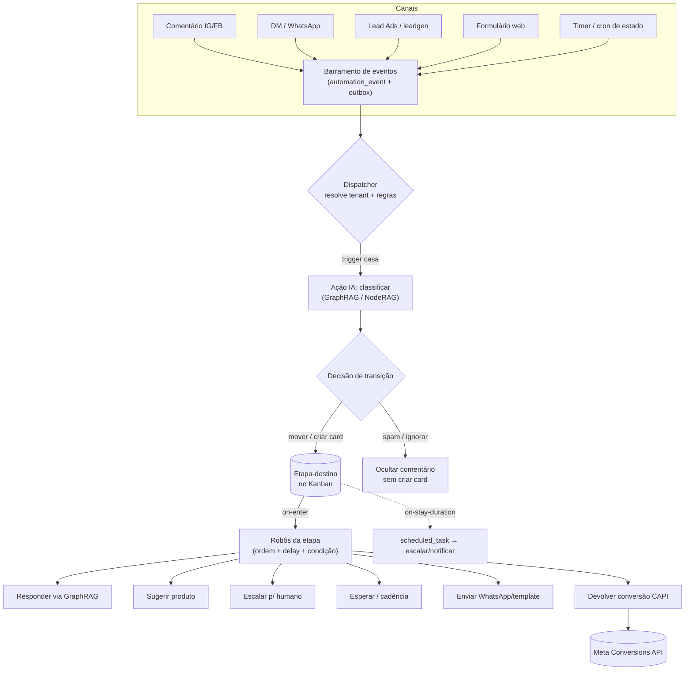

# Marketero — Triggers e Automações do Kanban (estilo Bitrix24)

> Funil em Kanban onde cada movimentação de card dispara automações: **triggers** movem o card para uma etapa reagindo a eventos, **robôs** executam ações ao entrar nela — com a IA GraphRAG decidindo a transição.

## Visão geral

O Marketero modela suas operações de marketing, vendas e atendimento como **funis em Kanban**: cada coluna é uma **etapa** do funil e cada card é um lead/contato/negócio que percorre essas etapas. O diferencial não é o board em si (concorrentes como BotConversa, Kommo e Clint já vendem CRM Kanban no WhatsApp — ver [concorrentes.md](./concorrentes.md)), mas o que move e o que age sobre os cards: um motor de **triggers e automações inspirado no Bitrix24**, onde a **classificação por GraphRAG/NodeRAG** preenche a decisão de transição.

A inspiração no Bitrix24 é explícita e a distinção conceitual central também. O Bitrix24 separa a automação de funil em **duas primitivas complementares**, ambas configuradas **por etapa** do pipeline:

| Primitiva | Direção | O que faz | Quando age |
|-----------|---------|-----------|------------|
| **Trigger** (gatilho) | **Inbound** — entra na etapa | Fica "à escuta" de um evento externo (ação do cliente/sistema) e, quando ele ocorre, **move o card PARA** a etapa onde o trigger está ancorado | Reage a um **evento** |
| **Regra de automação** (robô) | **Outbound** — parte da etapa | **Executa ações** (responder, criar tarefa, atribuir, esperar, webhook) | Ao **entrar** ou **permanecer** na etapa |

Citação canônica da documentação do Bitrix24: *"rules execute outbound actions upon stage arrival, while triggers monitor external events and respond by advancing items through the pipeline"*. Em outras palavras, na **mesma etapa** podem coexistir robôs que agem ao entrar e triggers que escutam para mover o card adiante. Exemplo canônico: numa etapa, um **robô** envia a fatura quando o negócio chega; um **trigger** de "pagamento recebido" move o negócio para a próxima etapa quando o cliente paga.

No Marketero essa dualidade mapeia quase 1:1:

- Os **eventos de canal** (comentário no IG/FB, DM, WhatsApp recebido, Lead Ad preenchido, formulário web, compra na loja) são **triggers** que movem o lead pelo funil.
- A **IA GraphRAG + ações** (classificar, responder, sugerir produto, escalar, etiquetar, esperar, webhook, devolver conversão à Meta via CAPI) são os **robôs** da etapa.

> **Decisão de design central:** modelar **duas entidades separadas** no schema — nunca uma só. Trigger é condição de **entrada** ancorada na etapa-destino; robô é ação de **saída** executada ao entrar. Replicar na UI um painel por coluna com duas faixas: *"Mover card para cá quando…"* (triggers) e *"Quando o card chega aqui…"* (robôs). Isso evita a confusão comum de fundir "condição de avanço" e "ação" num único nó.

## Conceitos e terminologia

| Termo | Definição |
|-------|-----------|
| **Pipeline (funil)** | Sequência ordenada de etapas para um tipo de operação (Vendas, Atendimento, Recuperação de carrinho, Conteúdo). Um tenant pode ter múltiplos pipelines independentes. |
| **Etapa / Coluna** | Estado discreto do card dentro do pipeline (ex.: `new`, `contacted`, `qualified`, `won`, `lost`). Cada coluna do Kanban possui seu próprio conjunto de triggers e robôs. |
| **Card / Negócio** | Item que percorre o funil. No Marketero é o **Contact deduplicado** (uma pessoa, N leads — ver [integracao-meta-lead-ads-crm.md](./integracao-meta-lead-ads-crm.md) §6.2/§6.4), com o snapshot imutável do Lead guardado como histórico. |
| **Trigger (gatilho)** | Regra **inbound** ancorada numa etapa-destino: escuta um evento e, ao ocorrer, **move o card para** aquela etapa. |
| **Regra de automação / Robô** | Regra **outbound** que **executa ações** quando o card entra (ou permanece) na etapa. |
| **Condição** | Filtro que decide **se** uma regra roda e a **quais** cards se aplica (operadores `eq/neq/gt/gte/lt/lte/in/contains/exists/matches`, combináveis com `AND`/`OR`). |
| **Ação** | Efeito executado por um robô (responder, mover card, criar tarefa, esperar, webhook, ação de IA, CAPI). |
| **Log de execução** | Registro append-only de cada execução de regra e de cada step (input/output/erro/tentativa), para auditoria, custo de IA e idempotência. |

## Catálogo de Triggers (eventos que movem cards)

Triggers são **sempre filhos de `(pipeline, etapa)`**, nunca globais — o mesmo evento "WhatsApp recebido" pode comportar-se diferente no funil de Vendas, de Suporte ou de Recuperação de carrinho. Dividem-se em duas famílias: **PUSH** (webhook de canal) e **PULL/TIMER** (cron sobre o estado do card).

| Trigger | Família | Gatilho (evento) | Condição típica | Etapa-destino sugerida |
|---------|---------|------------------|-----------------|------------------------|
| **Comentário novo (IG/FB) classificado pela IA** | PUSH | Webhook `comments` do canal + classificação GraphRAG | `intent in (dúvida, intenção_de_compra)` e `not spam` | `new` / abrir card no funil de Vendas |
| **DM recebida (Instagram)** | PUSH | Webhook `messages` (DM, story reply/mention) | primeira mensagem do contato | `contacted` (Em atendimento) |
| **WhatsApp recebido** | PUSH | Mensagem nova no Inbox/WhatsApp Cloud API | `message contém keyword` **ou** intenção semântica | `contacted` |
| **Lead Ads / webhook `leadgen`** | PUSH | Webhook `leadgen` (entrega só IDs → re-fetch `GET` do `leadgen_id`) | sempre | `new` |
| **Formulário web próprio** | PUSH | Submissão do form hospedado/embedável do Marketero | mapeamento de campos válido | `new` |
| **Intenção de compra detectada pela IA** | PULL/Semântico | Saída do classificador GraphRAG (`ai.intent_detected`) | `intent = intenção_de_compra` e `confidence ≥ 0.8` | `qualified` |
| **Sem resposta por X tempo** | PULL/TIMER | Cron sobre `entered_stage_at` / `first_contacted_at`; janela de 24h expirando | `time_in_stage > X` e `not respondido` | escalar / notificar / etapa de reativação |
| **Tag aplicada** | PUSH | Tag adicionada ao card | `tag = vip` (ou outra) | etapa específica do segmento |
| **Campo alterado** | PUSH | `card.field_changed` (valor adicionado/alterado/limpo) | `path = card.custom.uf` e `value = SP` | etapa regionalizada |

> O **trigger semântico de intenção** é o diferencial sobre o Bitrix24, que só faz *match* literal de palavra-chave. O Marketero combina `Track Customer Messages` (por keyword) com **classificação GraphRAG** — match literal **e** semântico.

> **Movimento para trás (backward movement):** assim como no Bitrix24, cada trigger tem um flag controlando se pode **trazer o card de volta** de uma etapa posterior. Um lead já em `won` que manda nova mensagem **não** deve voltar para `new` automaticamente.

## Catálogo de Ações / Robôs (executados na etapa)

Robôs também são filhos de `(pipeline, etapa)` e cada um tem três parâmetros de execução (ver §6): **dependência** (sequencial vs. paralelo), **timing** (imediato / após delay / agendado) e **condição**. As **ações de IA** são cidadãs de primeira classe — é nelas que mora o fosso defensável.

### Ações de IA (exclusivas do Marketero)

| Ação | Descrição |
|------|-----------|
| **Classificar evento** | A IA rotula o evento (dúvida, elogio, reclamação, intenção de compra, spam) — a saída **decide a coluna de destino**. |
| **Responder via GraphRAG/NodeRAG** | Resposta contextualizada pelo grafo (clientes, produtos, conversas, campanhas, vendas). Operacionalizada por reply em comentário, *private reply* comentário→DM, ou `POST` de mensagem. Não é diálogo fixo nem LLM-por-prompt. |
| **Sugerir produto do grafo** | Cruza grafo de produto + histórico do contato para recomendar o item certo na resposta. |
| **Gerar criativo (Nano Banana)** | Variante de `generate` que chama o Nano Banana/Gemini para gerar imagem — usada no board de Conteúdo. |
| **Escalar para humano** | Aplica a tag `HUMAN_AGENT` (permite responder fora da janela de 24h por até 7 dias), muda `assigned_to` e a coluna, entregando contexto completo ao atendente. |

### Ações operacionais (paridade com concorrentes)

| Ação | Descrição |
|------|-----------|
| **Etiquetar (add_tag)** | Aplica labels ao card (intenção, canal, campanha via `utm`/`tracking_params`). |
| **Enviar WhatsApp / template / DM / comentário** | Envia mensagem por template ou dinâmica no canal correspondente. |
| **Criar tarefa** | Cria tarefa para o time (handoff IA→humano). |
| **Atribuir responsável** | Define/troca `assigned_to` (distribuição: rodízio, região, interesse, carga). |
| **Esperar / delay** | Primitiva de primeira classe para cadências (ex.: follow-up 24h depois). Suspende a execução (não bloqueia worker). |
| **Condicional if/else** | Avalia condições e ramifica em `then`/`else`. |
| **Webhook (saída)** | Chama URL externa com parâmetros (ERP/loja/marketplace), com timeout + circuit breaker. |
| **Mover card / mudar campo / mudar pipeline** | Transição de estado; pode mover o card **entre pipelines** (ex.: Atendimento → Vendas quando a IA detecta intenção). |
| **Devolver conversão à Meta (CAPI)** | Efeito da transição para `qualified`/`won`: `POST` ao dataset da Meta, gravando `conversion_synced_at` (idempotência). |

> A regra de **espera/delay** é crítica para cadências de nurturing WhatsApp-first e **deve ser primitiva de primeira classe**, não um hack. Permite cadências resilientes: `msg → espera 24h → se não respondeu, nova msg → espera 3d → tarefa para vendedor`.

## Modelo unificado evento → classificação IA → ação

O modelo descrito na [visao-geral.md](./visao-geral.md) (§"Automação de fluxos", l.33-45) — **evento → classificação → ação** — e o motor de triggers de Kanban são **a mesma máquina vista de dois ângulos**:

- O modelo da visão-geral é **event-driven (push)**: chega algo, a IA classifica, dispara ação.
- O Kanban é **state-driven (pull)**: o card tem um estado (coluna) e regras por estado.

A ponte: **a classificação da IA é a função de transição da máquina de estados** — mapeia `(estado_atual, evento) → (próxima_coluna, ações)`. Formalmente:

```
trigger (evento de canal OU timer)
   → classificação GraphRAG (rótulo, intenção, sugestão de produto/resposta)
      → decisão de transição (mover card, criar card ou manter)
         → execução de ações (responder, etiquetar, escalar, CAPI)
```

A tabela `lead_pipeline` ([integracao-meta-lead-ads-crm.md](./integracao-meta-lead-ads-crm.md) §6.2) é a tabela de **ESTADO**; a engine de classificação é o **ROTEADOR**; as ações são os **EFEITOS**. Assim, "regras + IA" são automações de Kanban onde, em vez de o usuário escrever cada `if/then`, **a IA preenche o ramo de decisão a partir do grafo**.

> Eventos com pessoa identificável (DM, lead, form) **entram no board** como cards. Eventos sem card associado (comentário público, spam) podem agir **direto** (responder/ocultar) sem criar card.

## Gatilhos por movimentação de etapa

O segredo de implementação é que **todo movimento de card emite UM único evento canônico**, na mesma transação que o `UPDATE` do card: `card.stage_changed { card_id, from_stage_id, to_stage_id, moved_by, occurred_at }`. A partir dele o dispatcher deriva os três gatilhos:

| Gatilho | Como deriva | Exemplo |
|---------|-------------|---------|
| **on-enter** | Casar regras com `trigger.stage_entered.stage_id == to_stage_id` | Ao entrar em `qualified`, disparar CAPI |
| **on-exit** | Casar regras com `trigger.stage_exited.stage_id == from_stage_id` (quando `from != null` e `from != to`) | Ao sair de `new`, cancelar timers de SLA |
| **on-stay-duration** (tempo na etapa) | **Não** sai de um evento instantâneo — exige um **timer**: ao entrar, criar `scheduled_task(fire_at = now + duration)` | Lead em `new` sem contato há 2 dias → escalar |

**Ordem de execução dentro da etapa.** Cada robô tem: (1) **dependência** — "começar após os anteriores terminarem" (encadeamento sequencial) ou "rodar independentemente" (paralelo); (2) **timing** — imediato / após delay relativo / agendado para timestamp absoluto; (3) **condição**. Isso cria um pipeline ordenado dentro da etapa.

**Ramificações.** Seguindo o Bitrix24, **não há `if/else` num único nó nativo** — a regra simplesmente roda ou não. A ramificação emerge de regras paralelas com condições mutuamente exclusivas (`X` e `NOT X`).

> **Recomendação:** expor `if/else` **visual** no builder (UX de flow-builder tipo ManyChat/Pipedrive), mas **compilar** internamente para o modelo de regras-condicionais-por-etapa do Bitrix24 — ganha-se a UX de ramificação sem perder a robustez de avaliação por etapa.

**Pontos críticos do `on-stay-duration`:**

- Ao **disparar** o stay-timer, **revalidar** que o card AINDA está no mesmo stage e que `entered_stage_at` não mudou — senão é no-op/cancelado (evita escalonamentos fantasma).
- Ao **sair** do stage, **cancelar** (`status = cancelled`) os `scheduled_task` pendentes daquele `(card, stage)`.
- `entered_stage_at` no card é a **fonte de verdade** do "há quanto tempo".

## Diagrama do fluxo



## Exemplos de fluxo end-to-end

### Cenário 1 — Lead Ads → qualificação → atendimento WhatsApp → proposta → Ganho + CAPI

1. **Trigger PUSH:** webhook `leadgen` chega (só IDs) → re-fetch `GET` do `leadgen_id` → cria card em **`new`** (funil de Vendas).
2. **on-enter `new`:** robô **Responder via GraphRAG** envia primeira mensagem WhatsApp + robô **Notificar** (speed-to-lead); `on-stay-duration` arma timer de SLA (sem contato em X min → escalar).
3. **Trigger PUSH:** WhatsApp recebido com intenção de compra → IA classifica → move card para **`qualified`**.
4. **on-enter `qualified`:** robô **Sugerir produto do grafo** + robô **Devolver CAPI** (`event_name = qualified_lead`, `action_source = system_generated`), gravando `conversion_synced_at`.
5. Vendedor envia proposta; ao fechar, card vai para **`won`** → on-enter `won` dispara **CAPI** (`closed_won`).

> **Timing do CAPI:** **não** disparar só em `won` (raro demais para o algoritmo aprender) — disparar também em `qualified` (~1/3 a 1/2 dos leads). Só para cards com `leadgen_id` (Lead Ads / IG Lead Ads); forms web próprios usam outro mecanismo (CAPI via dataset com `user_data` hasheado — **a definir** na [visao-geral.md](./visao-geral.md) §"Web forms").

### Cenário 2 — Comentário com intenção de compra → DM automática → card no funil

1. **Trigger PUSH:** webhook `comments` (IG/FB) → robô **Classificar evento** → `intent = intenção_de_compra`, `confidence = 0.92`.
2. **Ação direta (sem card ainda):** *private reply* comentário→DM com **Responder via GraphRAG** + **Sugerir produto**.
3. Como há pessoa identificável (a DM abre conversa), **cria card** em `new` no funil de Vendas e segue o Cenário 1 a partir do passo 2.
4. Comentário classificado como **spam** → robô **Ocultar comentário** (`hide`), **sem** criar card.

### Cenário 3 — Cadência de reativação por inatividade

1. **Trigger PULL/TIMER:** card parado em `contacted` há 3 dias sem resposta → move para **`reativação`**.
2. **on-enter `reativação`:** robô **Enviar template** (msg 1) → **Esperar 2 dias** → condicional: se respondeu, mover de volta para `contacted`; senão **Esperar 5 dias** → **Criar tarefa** para o vendedor.

## Arquitetura técnica

Coerente com a stack do Marketero (Turborepo + Bun, Next.js 16, TS, Postgres/Neon, CRM multi-tenant Lead→Contact→Pipeline existente, cérebro GraphRAG/NodeRAG, canais WhatsApp/Meta). Três planos: **definição no-code**, **execução evento-orientada durável** e **IA assíncrona**.

### Modelo de dados (esboço)

Separar **DEFINIÇÃO** (editada no builder, versionada) de **EXECUÇÃO** (append-only). `tenant_id` em **toda** tabela.

**Definição:**

```
pipeline(id, tenant_id, name, channel_scope)
stage(id, pipeline_id, tenant_id, name, position, type[new|active|won|lost], wip_limit)
card(id, tenant_id, pipeline_id, stage_id, contact_id→contact, lead_id→lead,
     title, value_cents, assigned_to, entered_stage_at, custom JSONB)
automation_rule(id, tenant_id, pipeline_id NULL, name, enabled, version,
     trigger JSONB, definition JSONB /* grafo de ações */,
     max_executions_per_card INT NULL, created_by)
```

**Execução (append-only):**

```
automation_event(id ULID, tenant_id, aggregate_type, aggregate_id, type,
     payload JSONB, dedupe_key TEXT UNIQUE, occurred_at, seq BIGSERIAL /* ordem por aggregate */)
rule_execution(id ULID, tenant_id, rule_id, rule_version, event_id, card_id,
     status[pending|running|waiting|completed|failed|cancelled],
     current_step_id, context JSONB, depth INT /* anti-loop */, started_at, finished_at)
execution_log(id, execution_id, tenant_id, step_id, action_type, status,
     input JSONB, output JSONB, error JSONB, attempt, started_at, finished_at)
scheduled_task(id, tenant_id, execution_id NULL, card_id, kind[delay|on_stay_duration|wait_until],
     rule_id, fire_at, dedupe_key UNIQUE, status[pending|fired|cancelled])
```

> **Reuso:** `contact(id)` e `lead(leadgen_id)` já existem ([integracao-meta-lead-ads-crm.md](./integracao-meta-lead-ads-crm.md) §6.2). O `lead_pipeline.stage` atual (hoje um `TEXT` solto `new|contacted|qualified|won|lost`) vira **FK** para `stage(id)`, versionável por tenant. `scheduled_task` é o coração dos timers (delays/on-stay). `card.entered_stage_at` é o relógio do `on-stay-duration`.

### Motor evento-orientado / fila

Padrão em 4 camadas:

1. **Produção via Transactional Outbox:** qualquer mutação de card escreve, **na mesma transação**, a linha em `automation_event`. Evita o anti-padrão dual-write (app→fila) — nenhum evento se perde no crash.
2. **Notificação via LISTEN/NOTIFY:** trigger `AFTER INSERT` emite `pg_notify`. É apenas um **sino** para acordar o dispatcher — a fonte de verdade é a tabela. Polling de fallback `SELECT ... FOR UPDATE SKIP LOCKED WHERE status='pending' ORDER BY seq`.
3. **Fila durável:** **pg-boss** (fila sobre o próprio Postgres/Neon — zero infra extra, recomendado para começar), **BullMQ** (precisa Redis/Upstash — *rate-limiter* nativo por fila, útil para throttle de canal) ou **Cloudflare Queues/Workflows** se serverless-first.
4. **Worker idempotente com checkpoint:** após cada step persiste `current_step_id` + `context`; retry retoma do último step sem reexecutar ações já feitas.

> **Atenção Neon:** com autosuspend/pooling (PgBouncer transaction mode), **LISTEN/NOTIFY não é confiável**. Nesse caso o dispatcher depende de **POLLING (SKIP LOCKED)** como mecanismo primário e NOTIFY vira otimização opcional via conexão direta sem pooler.

> **A definir:** fila concreta (pg-boss vs. BullMQ vs. Cloudflare) — depende de já haver Upstash/Redis no projeto. Se o throttle de WhatsApp for prioridade, BullMQ ganha pelo rate-limiter nativo.

### DSL JSON de condições e ações

A regra inteira é um JSON **versionado**, editado pelo builder no-code (nunca à mão), validado com **Zod** no save e no load. Recomenda-se um JSON Schema da DSL como contrato compartilhado no monorepo (ex.: `packages/automation-dsl`).

```jsonc
{
  "trigger": { "type": "card.stage_entered", "stage_id": "qualified", "pipeline_id": "vendas" },
  "conditions": {
    "all": [
      { "path": "card.value_cents", "op": "gte", "value": 100000 },
      { "any": [
        { "path": "contact.tags", "op": "contains", "value": "vip" },
        { "path": "card.custom.uf", "op": "eq", "value": "SP" }
      ]}
    ]
  },
  "actions": [
    { "id": "a1", "type": "ai_action", "params": { "op": "classify", "output_var": "cls" } },
    { "id": "a2", "type": "condition",
      "if": { "path": "{{steps.a1.output.intent}}", "op": "eq", "value": "intencao_de_compra" },
      "then": [
        { "id": "a3", "type": "send_whatsapp_template", "params": { "template_id": "proposta" } },
        { "id": "a4", "type": "delay", "params": { "for": "PT1H" } },
        { "id": "a5", "type": "move_card", "params": { "to_stage_id": "proposta" } }
      ],
      "else": [ { "id": "a6", "type": "add_tag", "params": { "tag": "frio" } } ]
    },
    { "id": "a7", "type": "http_webhook" }
  ]
}
```

**Tipos de trigger:** `card.stage_entered` · `card.stage_exited` · `card.stay_duration` · `card.created` · `card.field_changed` · `channel.message_received` · `channel.comment_received` · `ai.intent_detected`.

**Controle de fluxo:**

- **Sequência** = ordem do array.
- **`if/else`** = node `type:condition` com ramos `then`/`else`.
- **Delay** = cria `scheduled_task(fire_at = now + for)`, marca a execução `status = waiting`; o worker **suspende** (não usa `sleep` bloqueante) e um scheduler reacorda no `fire_at`.
- **Wait por evento externo** = node `wait_for_event` registra a execução aguardando `(tenant, card, event_type)` com timeout; quando o evento chega o dispatcher casa e retoma.

> Isso é um **motor de workflow durável** (estilo Temporal/Vercel Workflow/Cloudflare Workflows): delays e waits **não consomem worker** — são continuations dirigidas por timer/evento. O versionamento (`automation_rule.version` + `rule_execution.rule_version`) garante que execuções longas em andamento (ex.: delay de 2 dias) continuem com a definição com que começaram, mesmo se o usuário editar a regra.

### Onde a IA entra (sempre desacoplada)

A IA entra em **dois pontos**, ambos **assíncronos**, para nunca bloquear a fila nem o ack do webhook:

1. **Como AÇÃO** (`ai_action`, `op: classify|generate|decide`): o worker **não** chama o LLM inline — enfileira um job numa **fila de IA separada** (concorrência/rate-limit próprios, pois latência de LLM é ordens de grandeza maior) e marca `status = waiting`. O job chama o NodeRAG (recupera `contact`, produtos, conversas, campanhas, histórico), produz output estruturado (ex.: `{ intent, confidence, suggested_reply, product_ids }`), grava no `context` e reacorda no próximo step. Para `decide`, a IA **retorna qual ramo seguir**.
2. **Como TRIGGER** (`ai.intent_detected`): um classificador roda na ingestão de mensagens/comentários e, ao detectar intenção, emite o evento — regras disparam sobre `intent = intencao_de_compra`.

> **Contrato e guardrails de IA:** toda saída é validada (Zod/JSON Schema) antes de virar decisão; `confidence` baixa cai em **ramo de fallback humano** (escalar). O job de IA tem `idempotency-key (execution_id, step_id)` — retry **não re-gera** chamada cara ao LLM; cacheia o resultado. `execution_log` guarda input/output/tokens para auditoria e custo. Cachear por `(tenant, contact, intent)` é essencial dado o custo de recuperação no grafo.

### Idempotência e retries

Idempotência em **3 níveis**:

- **Evento:** `automation_event.dedupe_key UNIQUE` (ex.: `sha256(card_id|stage_changed|from|to|bucket)`); webhooks entram com `dedupe_key` = id natural do provedor (`leadgen_id`, message id) e `INSERT ON CONFLICT DO NOTHING` (igual à ingestão de webhooks, §3.3 do doc de CRM).
- **Execução:** `UNIQUE(rule_id, event_id)` impede que o mesmo evento crie duas execuções da mesma regra.
- **Ação com efeito externo:** `idempotency-key` determinística por `(execution_id, step_id)` — retry não envia mensagem duas vezes.

**Retries:** backoff exponencial com jitter, `max attempts` por step; ao esgotar, vai para **DLQ** (`status = failed` + log) sem travar a fila. **Ordenação:** eventos do mesmo `card_id` em ordem de `seq` (FIFO por card via hash/groups); ordem global não é necessária nem desejável.

## Riscos e anti-padrões

| Risco | Defesa |
|-------|--------|
| **Loops de automação** (card dispara trigger que move card que dispara trigger…) | (a) **Guarda de profundidade** — `depth` + `causation_chain`; se `depth > limite` (ex.: 10), para e loga "loop guard tripped". (b) **Dedupe** por `dedupe_key`. (c) **`max_executions_per_card`** por regra. (d) **No-op detection** — `move_card` para o stage atual **não** emite `stage_changed`. (e) **Detecção de ciclo em design-time** no builder (A→X, X→Y, Y→X). |
| **Rate limits Meta / WhatsApp** | **Token-bucket por `(tenant, canal)`** na frente de toda action de envio (WhatsApp Cloud tem tiers 1k/10k/100k + janela 24h; Meta limita por Page — erro `32`/`613`). Ao estourar, a action **não falha** — **re-agenda** (`scheduled_task`) respeitando o limite; respeitar `X-Business-Use-Case-Usage`; **fila separada por canal** para que throttle de WhatsApp não bloqueie IG. |
| **Ordenação de eventos** | Webhooks chegam fora de ordem → ordenar por `created_time`/`timestamp` do payload, **não** por chegada. FIFO por `card_id` (senão `stage_exited` roda depois de `stage_entered`). |
| **Multi-tenant** | `tenant_id` em toda tabela, query e mensagem de fila. **Postgres RLS** como rede de segurança além do filtro de aplicação (reforço barato; isolamento já é exigência de ToS da Meta). Nunca regra do tenant A age sobre card do tenant B. |
| **Noisy neighbor** | Cota/rate-limit de execução **por tenant**; fairness via filas por tenant ou weighted scheduling — um tenant barulhento não esgota os workers. |
| **Outros guardrails** | Secrets de canal (`page_access_token`) cifrados; `http_webhook` com timeout + circuit breaker; timers em **UTC** (`fire_at`), tolerando atraso do scheduler; **modo de teste/simulação** (como o do Bitrix24) para validar regras antes de ativar em produção. |

> O **loop-guard é inegociável** num produto onde a IA decide ações: uma IA que responde comentário que dispara regra que… pode espiralar **custo de LLM**, não só de DB. E o **rate-limit por tenant+canal é existencial**: o WhatsApp suspende números que excedem limites — o motor precisa tratar throttle como **re-agendamento**, nunca como falha descartada.

## Roadmap / faseamento sugerido

| Fase | Escopo |
|------|--------|
| **MVP** | Pipeline padrão = `lead_pipeline.stage` existente (Vendas/Atendimento). Triggers PUSH essenciais (leadgen, WhatsApp/DM recebido, comentário). Outbox + polling (SKIP LOCKED) + pg-boss. Robôs: classificar, responder GraphRAG, etiquetar, atribuir, mover card, esperar. CAPI on-enter em `qualified`/`won`. Idempotência (3 níveis) e loop-guard. |
| **Fase 2** | `on-stay-duration` + scheduler de timers (speed-to-lead, reativação). Builder no-code visual com `if/else` compilado para regras-por-etapa. Condições `AND`/`OR` + biblioteca de **templates prontos** (estilo RD/HubSpot). Rate-limiter por `(tenant, canal)`. Modo de teste/simulação. |
| **Fase 3** | Trigger semântico `ai.intent_detected`. Ação **sugerir produto do grafo**. Múltiplos pipelines por tenant + mover card **entre pipelines**. Board de **Conteúdo** (Ideia→Criativo Nano Banana→Aprovação→Agendado→Publicado→Engajamento) ligado ao board de Vendas. |
| **Avançado** | `wait_for_event` (continuations dirigidas por evento). Enrollment por critério (HubSpot). Distribuição inteligente de leads (rodízio/região/carga). Observabilidade de custo de IA por execução. RLS por tenant. CAPI para forms web próprios (dataset com `user_data` hasheado). |

## Glossário

- **Trigger (gatilho)** — regra *inbound* que **move o card para** uma etapa ao ocorrer um evento.
- **Robô / Regra de automação** — regra *outbound* que **executa ações** ao entrar/permanecer numa etapa.
- **on-enter / on-exit / on-stay-duration** — gatilhos derivados da entrada, saída e tempo de permanência numa etapa.
- **Transactional Outbox** — padrão de escrever o evento na mesma transação da mutação, garantindo que nenhum evento se perca.
- **DLQ (Dead Letter Queue)** — fila de mensagens que esgotaram retries, isoladas para não travar a fila principal.
- **Loop-guard** — guarda de profundidade que interrompe cadeias de automação que se realimentam.
- **CAPI (Conversions API)** — API da Meta para devolver conversões server-side, otimizando campanhas.
- **DSL** — *Domain-Specific Language*; aqui, o JSON versionado que descreve trigger + condições + grafo de ações.

## Documentos relacionados

- [visao-geral.md](./visao-geral.md) — visão geral do produto e o modelo evento → classificação → ação.
- [concorrentes.md](./concorrentes.md) — análise de mercado (Kommo, BotConversa, Clint, RD, Pipedrive, HubSpot) e o que copiar vs. diferenciar.
- [integracao-meta-lead-ads-crm.md](./integracao-meta-lead-ads-crm.md) — fluxo Lead Ads → mini-CRM, pipeline `new→contacted→qualified→won/lost` e Conversion Leads (CAPI).
- [instagram.md](./instagram.md) — webhooks de canal (comments, mentions, messages, postbacks, referral, optins), a espinha dorsal dos triggers PUSH.
